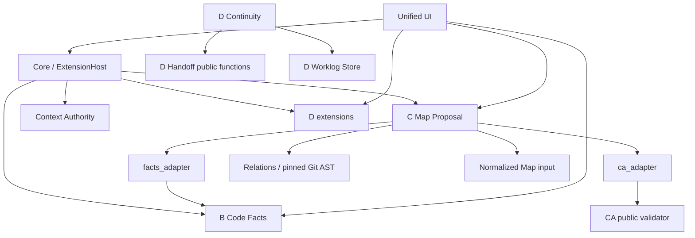

# PROJECTMIND_FINAL_INDEPENDENT_VERIFICATION

**结论：C 和 BCD 当前不能维持 READY 声明。真实 B、CA 与 A30 集成已确认，但复现了 3 项 C 的 HIGH 缺陷，另有验收工具的 HIGH 假绿问题。架构具有真实扩展边界，仍有明确限制。**

本次只读审计未修复任何发现，未保存报告文件。测试使用临时夹具；变异复核只在独立进程内存中替换代码。

## 1. Frozen Heads

### FROZEN_IDENTITIES

| 对象 | 分支 | 完整 SHA |
|---|---|---|
| MAIN | `main` | `7484d44ddeac3c054ca3ba68f92293d965bb615c` |
| C | `integration/c-convergence-v1` | `4d1b3fc162f96be14d9aafc1f867880dd0a485cc` |
| B | `feat/30-code-facts-integration` | `80e091acefd278fda03e188a125147b0aa5eedc5` |
| D | `feat/handoff-continuity` | `8f00be38532f3f5e9823aec8cbf430038cc9ff4b` |
| CA | `feat/context-authority-mvp` | `9ea23491d1849f21bad9f60c1c1ca8df55bb5936` |
| A30 | `fix/core-extension-runtime-isolation` | `13c7ca8c7f64fce4c57fd49a48bb5c1b0b023a5e` |
| BCD | `integration/bcd-v1` | `deb9b9ff9339c7bb204b111bd748c3dc369d1d27` |
| UI | `feat/unified-ui-v1` | `674c70fce7c2000183c9ff45322184760386dde6` |

核对了 [PR #36](https://github.com/LingweiXingzhi/projectmind-core/pull/36)、[PR #37](https://github.com/LingweiXingzhi/projectmind-core/pull/37)、[PR #38](https://github.com/LingweiXingzhi/projectmind-core/pull/38)，均为 OPEN，head 与上表一致。

`git fetch origin` 因连接 GitHub 超时失败。随后通过 GitHub API 核对远端分支身份，与本地引用一致。

**HEAD_DRIFT：**

- 请求明确声明的 BCD `deb9b9f` 没有漂移。
- 历史 C 矩阵记录的是 `857e9d0`；报告的“LATEST STABLE”仍写 `7af59ea`，当前 C 是 `4d1b3fc`。这些证据不能直接当作当前 HEAD 的验证。
- `projectmind-integration-bcd` 工作目录实际位于 **UI 分支**。已确认其中 `extensions/`、`extension_host.py`、`tests/`、`data/` 与冻结 BCD 完全一致；`app.py` 的差异仅为两个 UI 静态资源入口。
- BCD 中的 C 目录与当前 C HEAD 完全一致；真实 B collector、CA 目录也分别与冻结来源一致。

## 2. Executive Verdict

| 对象 | 判定 | 主要依据 |
|---|---|---|
| C | **FAIL** | 关系删除证明、skipped 准入、CA head 语义存在 HIGH 缺陷 |
| B | **PASS_WITH_LIMITS** | 固定提交事实、明确 skipped、范围与资源限制成立 |
| D | **PASS_WITH_LIMITS** | 现有接续流程成立；存储隔离、故障耦合和信息保留有限 |
| BCD | **FAIL** | 依赖与隔离集成真实，但继承 C 缺陷；结构化 C→D 引用未实现 |
| UI | **PASS_WITH_LIMITS** | 三区导航与通用渲染边界保留；变化文件证据链接有错误 |

本次发现：**0 BLOCKER、4 HIGH、9 MEDIUM、2 LOW**。其中 C 实现有 **3 HIGH**，另一个 HIGH 属于验收矩阵。

独立复跑结果：

| 验证 | 本次实际结果 |
|---|---|
| 完整集成测试 | **212 项：210 通过、2 个环境夹具错误** |
| 两个错误在未修改 B+D 基线上重跑 | 同样错误 |
| UI／BCD 同源测试矩阵 | 两轮均报告 **30/30**，稳定 |
| 当前 C 分支矩阵 | 两轮也报告 **30/30**，但 S30 已证明是假绿 |
| 当前可执行的有效门禁变异 | **4 个均被语义断言捕获** |
| 其余历史变异 | M3 锚点漂移；M4 是无效 Python |

两个完整测试错误分别是 Windows 不允许创建字面量 `*.py` 文件，以及当前账户没有创建符号链接的权限。它们发生在测试样本构造阶段，不能记为通过，也不能归因于新增 C 代码。

### Standards

独立标准审查判定 **PASS_WITH_LIMITS**：B 保持代码事实边界；D 保留参与者记录、版本与历史；Core 存在真实目录发现和命名空间路由；统一 UI 支持未知提案和证据类型的通用显示。

主要限制是 D 存储的副作用与耦合、B 页面封闭的语言／声明类型校验，以及标准文档的实现状态漂移。运行期 A30 已实现，加载期异常隔离范围较窄。

### Spec

独立规格审查判定 **FAIL**：复现了目标域关系删除证明错误、B-skipped 证据域绕过、其他 subject 的 head 被误当成 target 矛盾，以及不支持的 import 解释静默遗漏。

**两轴分别统计：Standards 5 项，最高 MEDIUM；Spec 4 项，最高 HIGH。** 主审计另复现了声明分析与验证工具问题，详见下文。

## 3. C Deep Audit

### 架构与产品边界

C 的合理职责仍是：

`Git diff + B facts + 当前人工地图 + 可选 CA → proposals / unresolved / no_proposal / limits`

实现没有接管 B 的声明提取、CA registry、D 存储或正式地图编辑。旧 `candidates` 由已发布的 `NODE_ADD` 投影产生，没有发现第二套候选生成引擎。

但“一个完备 evidence gate”的声明不成立：发布构造器统一检查生命周期和基本形状，**事实资格仍依赖各通道分别检查**，完整证据域没有统一准入。

### 六种提案

全部经过 canonical constructor，保持 `PROPOSED`、`human_required=true`；ID 由 target、kind、subject、payload 的确定性哈希生成。

| Kind | 实际触发与证据 | 置信度／未知处理 |
|---|---|---|
| `NODE_ADD` | 新增 `.py`、未被地图覆盖、B 文件记录、非测试／生成噪声 | low；B 缺失进入 unresolved，但空 `entries` 错误地产生候选 |
| `RELATION_ADD` | pinned AST import 集合新增，映射不同节点域 | 单 owner 普通 import 为 medium；别名派生或多 owner 为 low；完整 skipped 域未封闭 |
| `RELATION_REMOVE_CANDIDATE` | import 消失、已有 map edge、扫描源域 | low；证明只针对一个目标文件，错误宣称整个目标域消失 |
| `IMPLEMENTATION_LINK_CHANGE` | rename 的旧路径归属节点，新路径未覆盖 | 单 owner medium，多 owner low；不生成 `NODE_ADD`；仍选首个 owner |
| `NODE_REMOVE_CANDIDATE` | pinned target tree 中全部 evidence 路径不存在 | low；部分保留阻止删除，读取失败进入 limits，same revision 不触发 |
| `RESPONSIBILITY_CHANGE` | B base/target 声明差异涉及 entryPoint | low；不选替代符号，但符号尾名匹配可误报；缺 base 比较可静默 |

禁止 position、自动 accept/reject、CA 自由文本作为候选事实依据的主要边界保留。

### 输入与 pinning

已确认：

- base、target 必须显式提供完整 40／64 位小写 SHA。
- 缺 pin、`HEAD`、短 SHA 被拒绝。
- 目标 B revision mismatch 在 supplied／installed 路径均被拒绝。
- same revision 先执行输入和 B gate，再返回零候选。
- 不同 pin 的空 `changed_paths` 按当前契约被拒绝。
- B base 与 target 分别调用、分别固定版本，没有用 C 重建声明。
- Git helper 清理继承的 `GIT_*`，禁止 lazy fetch；未发现工作树补证。
- facts 路径和 entryPoint 路径的校验仍不完整，见 C-08。

### 关系分析

目前确实采用 pinned base／target blob → AST → 归一化 import delta，没有继续用 patch 正则直接作证。

普通、别名、relative／parent-relative、多行、括号和多个 import，以及字符串、docstring、comment、等价重写的主要路径成立。读取／语法失败不会直接当成零 import。

仍有重要边界：

- 多源残留测试不能证明多目标域正确。
- package `__init__`、from-import 属性／子模块仍使用启发式解释。
- src-layout 没有适配或可见降级。
- `from importlib import import_module` 的直接／别名调用静默遗漏。
- 整个源域、目标域的 B skipped 状态没有统一检查。

### CA typed consumption

真实 builder、resolver、validator 已进入验证，并非只使用 CA-shaped fixture。

- **T1 有实际价值**：相关 team／architecture 上下文进入带溯源标签的 uncertainty，不进入候选 evidence、rationale 或 confidence。
- **T2 只证明了字段标签**：当前不显示字典值、不提供事实支撑；完整真实 verifier→pack→T2 路径为 **INSUFFICIENT_EVIDENCE**。辅助函数还只读取首条 verification reference。
- **T3 有 HIGH 语义错误**：任何 `implementation.*` 字典中的 `head` 都与 C target 比较，未识别 PR、baseline、组件等不同 subject。
- invalid pack 整包停用、stale 分区排除、neutral-key poison 不进入候选事实依据的主要边界成立。
- 因 T3 错误，整体 **SAFE + USEFUL 尚未成立**；不能以 T1 正例覆盖这一问题。

### 安全与确定性

未发现 C 写正式地图、改变 accepted 状态或生成 position 的路径。实际历史请求重复得到字节一致结果。

正式地图前后 SHA-256 相同：

`06aef0ccdf0961464169372a96ba3b4932e1891e7a00b3559717daad106119c5`

C 无时间戳、随机 ID 或 live verifier 调用；同样固定输入下，主要排序和身份生成具有确定性。

### Mutation 核验

| 变异 | 本次结果 |
|---|---|
| M1：关闭 B revision gate | 31 项测试中 4 个相关断言失败 |
| M2：放行 skipped relation source | 19 项测试中对应 skipped 断言失败 |
| M3：首个 claim 自动附证据 | 当前代码锚点不存在，不能按原机制重放 |
| M4：用文本代替 AST | 遗留孤立 `except`，编译即 `SyntaxError` |
| M5：允许 position | 构造器拒绝 position 的断言失败 |
| M6：自动 ACCEPTED | 生命周期断言失败 |

因此，**“6/6 semantic mutation caught”不能认可**。原 runner 把非零退出一律当 caught，没有落实其注释所说的 INVALID 分类。源码未被这些内存复核修改。

### S01–S30 矩阵逐项核对

下表是对 runner 全绿结果的证据限定，所有 oracle 均追溯至收敛计划 §8，未采用历史输出数量作 expected。

| 项目 | 实际依赖与结论 |
|---|---|
| S01 | FIXTURE；使用不存在的合成 SHA，不能标为真实 Git 正例 |
| S02 | REAL Git+B；正例成立，但未覆盖 skipped 目标域 |
| S03 | REAL Git；单目标、多源残留成立；多目标域反例失败 |
| S04 | FIXTURE+REAL Git 子目录变体；rename 正例成立 |
| S05 | MOCK tree；只绑定部分保留反例，删除正例在 S16 |
| S06 | REAL B+MOCK；真实消失正例成立，尾名碰撞未覆盖 |
| S07 | FIXTURE+MOCK B；注释变更反例成立 |
| S08 | REAL Git+supplied facts；格式变体通过 |
| S09 | FIXTURE+MOCK B；helper 不产生节点 |
| S10 | FIXTURE+MOCK B；内部 class 不产生节点 |
| S11 | REAL Git；字符串、docstring、comment 排除成立 |
| S12 | 混合 fixture；测试／生成噪声反例成立 |
| S13 | REAL B+fixture；只封闭 changed-source 场景 |
| S14 | REAL B+MOCK／supplied；revision gate 正反例成立 |
| S15 | 真实缺席／异常注入；降级成立 |
| S16 | MOCK tree；删除、早于 base、same revision 通过；读取失败测试未绑定此行 |
| S17 | 置信度／uncertainty 断言通过，未证明不任意选择首个 owner |
| S18 | 只测试缺文件记录，遗漏存在记录但 `entries=[]` |
| S19 | REAL CA+MOCK；基本冲突成立，foreign-head 绕过未覆盖 |
| S20 | REAL CA+MOCK；非现行分区排除成立 |
| S21 | REAL CA+MOCK；multi-scope 选择成立 |
| S22 | 人工字段 fixture／MOCK；真实 T2 支持不足 |
| S23 | MOCK validator；合法真实 unavailable pack 路径不足 |
| S24 | REAL CA+MOCK；digest tamper 整包停用成立 |
| S25 | REAL CA+MOCK；poison 不附候选证据成立，subject-aware T3 不足 |
| S26 | REAL 历史+fixture；重复结果确定性成立 |
| S27 | fixture；基本容器／地图错误受控拒绝 |
| S28 | changed／old／evidence 路径覆盖；facts／entryPoint 未封闭 |
| S29 | REAL 地图哈希+构造器；不写地图成立 |
| S30 | BCD 实际 A30 成立；C 分支 runner 假绿 |

矩阵不是靠“所有结果为空”通过：确有六种 kind 正例、真实 relation 正例和 T1 enrichment。**问题是覆盖域不完整，以及 runner 错误计算 PASS。**

## 4. C Findings

### BLOCKER

未发现。

### HIGH

**C-01 — 关系移除只证明一个目标文件，却宣称目标域消失。**  
位置：[relations.py / `_domain_import_gone`](G:/jiagou/projectmind-integration-bcd/extensions/map_proposal/relations.py:320)。

复现：`nb` 拥有 `b.py`、`b2.py`；源文件删除 `import pkg.b`，保留 `import pkg.b2`。真实 Git+B+C 仍输出 `RELATION_REMOVE_CANDIDATE na->nb`，uncertainty 为空。违反 A6／R03 的完整源—目标域证明要求。现有多源测试不覆盖多目标文件。即使采用 HUMAN_DECISIONS D1 的“职责域”解释，这个算法仍然错误。

**C-02 — B-skipped 准入没有覆盖完整证据域。**  
位置：[engine.py / wanted paths](G:/jiagou/projectmind-integration-bcd/extensions/map_proposal/engine.py:27)、[relations.py](G:/jiagou/projectmind-integration-bcd/extensions/map_proposal/relations.py:211)。

真实复现：

- 未变化的目标 `b.py` 有语法错误。installed B 只收集变化源，C 输出 medium `RELATION_ADD`；提供 full real B facts 后却静默取消，两条路径都没有 HUMAN_REQUIRED。
- 辅助源 `a2.py` 超过 B 的 1 MiB 限制，真实进入 skipped，但 C 仍读取它参与关系删除证明。

违反 A4／E-3。changed-source skipped 测试捕获不到这些绕过。

**C-03 — T3 错认 head subject，可释放相关冲突候选。**  
位置：[ca_adapter.py / `_independent_verification`](G:/jiagou/projectmind-integration-bcd/extensions/map_proposal/ca_adapter.py:284)。

复现：两个相关 architecture role claims 冲突时，`NODE_ADD` 被暂停；加入真实指向 base commit 的 `implementation.baseline.head` 后，C 因 `base != target` 声称出现独立验证矛盾，停用 conflict rows，重新发布该 `NODE_ADD`。

真实 CA loader、builder、resolver、validator 均参与，两包均通过结构校验。违反 A9：核验必须识别主张对象，不能把字段名相同当成同一事实。现有测试仅覆盖 `implementation.target_head`，没有其他 subject。

**V-01 — 验收矩阵能够产生假 PASS。**  
位置：[acceptance_matrix.py](G:/jiagou/projectmind-integration-bcd/tests/acceptance_matrix.py:119)。

已复现：

- `SkipTest` 被记录为 `True`。
- C 分支只有 5 个旧宿主测试，却被报告成“9/9，包含 4 个 A30”。
- 在同一 C 宿主直接注入 `SystemExit(7)`，实际逃逸。
- `INPUT_HASH` 是首组测试函数源码哈希，不能固定全部 fixture／依赖。

违反 A14／A17 和真实依赖不得跳过后算 PASS 的纪律。当前测试没有验证 runner 自身这些失败模式。

### MEDIUM

| ID | 位置／复现 | 影响、契约与测试缺口 |
|---|---|---|
| C-04 | [analysis.py](G:/jiagou/projectmind-integration-bcd/extensions/map_proposal/analysis.py:185)：真实 B 对空 `__init__.py` 返回 `entries=[]`，C 仍产生 `NODE_ADD` | 空声明被当成新增职责依据；违反 S18。当前测试仅省略 file 记录 |
| C-05 | [analysis.py](G:/jiagou/projectmind-integration-bcd/extensions/map_proposal/analysis.py:269)：顶层 `main` 保留，只删除 `Widget.main`，却声称 entryPoint `main` 消失 | 尾名匹配混淆声明身份；违反 A8。使用真实 B 声明 parser 已复现，现有测试未覆盖 |
| C-06 | [relations.py](G:/jiagou/projectmind-integration-bcd/extensions/map_proposal/relations.py:107)：直接／别名 `import_module()`、src-layout 返回空分析，无 relation UNKNOWN | 违反 A5 不支持解释必须可见。现有测试覆盖 attribute 调用和相对 import |
| C-07 | [analysis.py](G:/jiagou/projectmind-integration-bcd/extensions/map_proposal/analysis.py:306)：base B skipped／无比较时仅输出 no_proposal，无职责通道未知诊断 | 把未完成比较呈现为普通无提案；违反 A8／G-3。现有诊断测试只覆盖不可解析 entryPoint |
| C-08 | [model.py](G:/jiagou/projectmind-integration-bcd/extensions/map_proposal/model.py:193)、[facts_adapter.py](G:/jiagou/projectmind-integration-bcd/extensions/map_proposal/facts_adapter.py:19)：接受 `../../secret.py · main()` 与 `../secret.py` facts 路径 | 违反 S28 全来源路径约束。未发现越界文件读取；当前同名测试没有提交这些输入 |
| V-02 | [mutation_runner.py](G:/jiagou/overnight-c-convergence/tests/mutation_runner.py)：M4 编译失败仍算 caught，M3 当前锚点失效 | 历史 6/6 声明不成立；违反 A13 的有效语义变异要求。runner 未做有效性分类 |

### LOW

C 实现未另列 LOW；其他组件 LOW 见第 6、7 节。

## 5. B Audit

**B_READY_WITH_LIMITS**  
**B_EXTENSION_READY_WITH_LIMITS**

正确性边界成立：完整 commit SHA、真实 blob OID、明确 language／entries／skipped，不推断职责、调用关系或地图变化。

声明 schema 能容纳不同语言；当前 Python collector 是实现选择，契约允许首版只支持一门语言。

限制：

- requested paths 限制解析内容，但仍扫描完整 Git tree。
- 每文件读取启动 Git 子进程，没有缓存。
- 全树／内容预算超限会明确拒绝；部分 Git 对象读取错误终止请求，而非每文件 skipped。
- parser 没有注册机制，但新增 dispatcher／collector 可在 B 内完成。
- B 页面要求 `language === "python"` 和五个固定 kind；增加语言或 metadata kind 需要修改页面。

两个 Windows 夹具错误已在 B+D 基线上独立复现。其他已运行 B 测试没有发现客观事实被架构推断污染。

## 6. D Audit

**D_READY_WITH_LIMITS**  
**D_EXTENSION_READY_WITH_LIMITS**

已有稳定 ID、乐观版本、时间戳、追加事件、不可变历史版本、导入来源和新接手状态。JSON handoff 可以序列化、校验和读回。

D 没有调用 C private engine，也没有成为 B parser 或正式地图编辑器。但它目前接收的是 legacy `/api/explain` AI candidates，**没有结构化 C proposal-reference 契约**。

| ID | 严重度 | 证据、影响与测试缺口 |
|---|---|---|
| D-01 | MEDIUM | [worklog/store.py](G:/jiagou/projectmind-integration-bcd/extensions/worklog/store.py:256) 继承 `GIT_*`。传入 repo one，却设置 `GIT_DIR=repo two/.git`，实际定位并初始化 repo two 存储。违反仓库隔离承诺；普通双仓库测试未覆盖继承环境 |
| D-02 | MEDIUM | [continuity/store.py](G:/jiagou/projectmind-integration-bcd/extensions/continuity/store.py:212) 为取得路径而构造 Worklog Store。只损坏 Worklog SQLite，健康 Continuity 也抛 `DatabaseError`。违反 E3 无关功能隔离；现有测试仅覆盖健康存储 |
| D-03 | LOW | [continuity/model.py](G:/jiagou/projectmind-integration-bcd/extensions/continuity/model.py:51) 接收 checklist `state=[]` 时抛原始 `TypeError`，最终 500 | 格式错误应受控 400；现有测试没有不可哈希字段值 |

导入会重置本机 readiness，这是合理行为。但先前 `record.review` 的四项接手检查及参与者信息没有作为未核实历史保留。当前 roundtrip 是选定字段的保留，不能声称完全无信息损失。

存储与 JSON 文档之间已有模块边界，但 Continuity 的路径依赖 Worklog 构造副作用，削弱了未来存储替换。

## 7. BCD Integration

实际依赖方向如下：

没有发现 B→C、C→D private import 或 C 写 D 存储的循环。

公共调用：

- C→B：`collect_code_facts(repo, revision, paths)`，有接口契约。
- C→CA：`validate_context_pack`，经适配模块消费。
- D 内部复用 Handoff／Worklog：函数接口存在，但存储路径推导依赖实现结构。
- UI 调用 HTTP 公共接口，没有直接导入 C engine 对象。

**运行验证：**

- BCD 加载七个实际扩展。
- 分别让 B、C、D Handoff、CA handler 抛 `SystemExit(7)`，均得到受控 500；其他三类接口继续返回。
- A30 在 BCD 运行时有效。C-only 分支仍会逃逸。
- 使用冻结 `deb9b9f` 的 Core 源码在内存中执行真实 compare，随后调用真实 B、CA builder／validator、C、D handoff 校验。版本均固定到同一 target，地图不变。
- C 结果直接作为 D 的 `aiCandidates` 会被拒绝。D handoff 自身可导入，但 **C→D 结构化提案引用环节尚未完成**。

**HOST-01 — LOW：** [extension_host.py](G:/jiagou/projectmind-integration-bcd/extension_host.py:83) 加载期只包含 `Exception/SystemExit`；扩展显式抛 `GeneratorExit`／`KeyboardInterrupt` 的探针可逃出构造器。加载失败隔离测试没有覆盖这些类型。它不否定运行期 A30 修复；处理 `KeyboardInterrupt` 还需保留操作员中断语义。

## 8. Extensibility Verdict

| 维度 | 判定 | 依据 |
|---|---|---|
| HOST EXTENSIBILITY | **STRONG** | 目录发现、命名空间路由、动态入口；隔离有上述限制 |
| B PARSER EXTENSIBILITY | **ADEQUATE** | 可局部增加 dispatcher／collector，尚无注册机制 |
| B SCHEMA EXTENSIBILITY | **ADEQUATE** | facts 外形通用，页面验证封闭 |
| C ANALYSIS EXTENSIBILITY | **ADEQUATE** | analysis、relations、CA 模块分离；语言选择写在调度器 |
| C PROPOSAL-KIND EXTENSIBILITY | **ADEQUATE** | kind 集中定义，handler 局部增加，UI 有 fallback |
| C EVIDENCE EXTENSIBILITY | **WEAK** | 形状构造集中，完整域资格准入没有集中封闭 |
| CA-CONSUMPTION EXTENSIBILITY | **WEAK** | 独立模块存在；T3 缺 subject-aware policy |
| D RECORD-SCHEMA EXTENSIBILITY | **ADEQUATE** | JSON 记录、format/version 存在；白名单和投影需迁移 |
| D STORAGE EXTENSIBILITY | **WEAK** | Store 边界存在，但路径定位有跨库副作用 |
| UI COMPOSITION EXTENSIBILITY | **ADEQUATE** | 三产品区、动态扩展入口、提案／证据 fallback |
| CROSS-MODULE COUPLING | **ADEQUATE** | B/C/D 方向清楚；D 内部存储耦合是例外 |
| BACKWARD COMPATIBILITY | **WEAK** | 有 legacy projection，状态词汇与 schema 演进尚未固定 |

组件扩展判定：

- **C_EXTENSION_READY_WITH_LIMITS**
- **B_EXTENSION_READY_WITH_LIMITS**
- **D_EXTENSION_READY_WITH_LIMITS**

没有证据支持“扩展 hostile”；也没有证据支持所有未来变化只需添加一个新文件。未发现需要保留的庞大、无用泛化框架。

## 9. Five Future-Change Simulations

| 变化 | 期望变化 | 当前实际需要变化 | 判定 |
|---|---|---|---|
| TypeScript | B collector、C relation adapter | B `facts.py` 与页面；C engine／analysis 的 `.py` gate、relations parser／resolver | **LEAKY SEAM**；不需要 Core／D 重写 |
| `API_CONTRACT_CHANGE` | C kind／handler、review 展示 | C model、handler／channel、调度接线；UI 可直接 fallback，专用展示再加标签 | **GOOD SEAM**；D 引用能力另缺契约 |
| D `DECISION_LOG` | D schema／renderer | 普通决策已有 `decision` category；新 workflow 需 D 状态／事件与页面映射 | **LEAKY SEAM，范围局限 D** |
| 替换 CA verifier | CA adapter／provider | 保持 pack 契约时改 CA；改变 subject／字段语义时也需 C `ca_adapter` | **GOOD SEAM，契约变化需迁移** |
| 独立 extension E | 新扩展目录与测试 | 同左；可选页面，重启发现 | **GOOD SEAM**；无须手工 Core 路由 |

未来 Map schema 的输入归一化集中在 C model，适配边界实际存在。未来 confidence policy 目前需要修改 analysis／relations，尚未独立成公共策略入口。

## 10. What Is Actually Future-Proof

当前代码支持的事实：

- 新普通扩展不需要修改 Core 路由。
- B 的事实契约没有强制 Python 成为永久产品语义。
- C 存在单一 canonical 输出和 legacy 投影。
- 新提案 kind／evidence kind 可以由统一 UI 通用显示。
- D 的记录版本与追加历史允许局部演进。
- verifier 在 CA 内替换且保持 pack 契约时，C 不需全引擎改写。
- 当前没有要求 B、D 随每个 C kind 重写的依赖循环。

## 11. What Looks Extensible But Is Actually Hard-Coded

- C 调度、声明与 relation 模块多处硬编码 `.py`、Python declaration kind、import 解释。
- “统一 evidence gate”目前没有封闭整个证据域。
- CA T3 以 `implementation.* + head` 代替真正的 claim subject 类型。
- T2 默认真实验证链与允许注释的 domain 不对齐。
- B 页面仅接受 Python 和五种声明 kind；Node 执行验证器已确认 TypeScript／annotation 被拒绝。
- D task、category、event、导入投影采用固定白名单，未知 metadata 不会自动保留。
- Continuity 存储路径依赖 Worklog Store 对象布局。
- 验收工具依赖固定 `G:\jiagou` 外部工作目录；缺失依赖又可能被错误算 PASS。
- UI review 没有提交 CA pack，因此该页面通常运行在无 Context 模式。

**UI-01 — MEDIUM：** [review.js](G:/jiagou/projectmind-integration-bcd/web/review.js:116) 给所有变化文件建立 target `/api/evidence` 链接，而该接口只接受地图声明路径。新增未映射文件返回 400，已删除声明文件在 target 返回 404，rename 也没有旧路径来源。违反既有 evidence API 契约与 UI 证据链目标；现有后台测试没有覆盖新前端组合。

未知 proposal／evidence 类型有文字 fallback。未知 D category 在导入时受控拒绝；没有证明它能自动成为新可编辑记录。完整浏览器交互回归本次为 **INSUFFICIENT_EVIDENCE**，没有沿用先前截图的 PASS。

## 12. Human Decisions

依据当前 [HUMAN_DECISIONS.md](G:/jiagou/overnight-c-convergence/HUMAN_DECISIONS.md)：

| 决策 | 分类 | 架构影响 |
|---|---|---|
| D1：evidence 是参考还是职责域 | **BLOCKS DESTRUCTIVE PROPOSAL CONFIDENCE ONLY** | 删除证明的职责域不能被默认当成已确认；未来可能需要独立 implementation/domain 路径 |
| D2：地图节点必填字段 | **NON-BLOCKING PRODUCT POLICY** | Core 当前代码／接口已要求这些字段；C 是否允许宽容 intake 仍需明确 |
| D3：status vocabulary | **NON-BLOCKING PRODUCT POLICY** | 影响外部消费者和兼容过渡；当前规则输出没有冒充 AI |
| D4：无地图 greenfield | **BLOCKS FUTURE EXTENSION** | 当前明确拒绝；首次地图构建流程尚未定义 |
| D5：B shape tolerance | **NON-BLOCKING PRODUCT POLICY** | 影响 schema 漂移可见性和向后兼容边界 |
| D6：T2 confidence uplift | **NON-BLOCKING PRODUCT POLICY** | 约束 CA support／confidence 策略；当前不提升置信度 |

这些不是本次发现的编码缺陷。尤其 D1 无法解释或豁免 C-01：当前实现连自身采用的完整目标域都没有正确证明。

## 13. Documentation Drift

现行标准已读取：AGENTS、AGENT_STANDARD、TEAM_SOP、COLLABORATION_CONTRACT、MVP_INTERFACES、EXTENSION_INTERFACE。

主要漂移：

- [MVP_INTERFACES.md](G:/jiagou/projectmind-integration-bcd/docs/standards/MVP_INTERFACES.md:72) 仍把 B/C/D 业务能力写为未实现提案。
- [COLLABORATION_CONTRACT.md](G:/jiagou/projectmind-integration-bcd/docs/standards/COLLABORATION_CONTRACT.md:22) 的 main／基线分支说明过时。
- B README 仍写 C 未实现。
- [C engine 注释](G:/jiagou/projectmind-integration-bcd/extensions/map_proposal/engine.py:10) 仍写通道为空、等待 W2/W3。
- 风险登记、证据格和自审报告属于较早快照，不能覆盖当前实现。
- FINAL_REPORT 的 6/6 mutation、0 HIGH、全部机器验收满足不能由本次证据支持。
- C→D 提案引用、完整证据域 gate、T2 真实消费等尚未成为已实现公共契约。

文档更新应区分公共契约、实现细节、未来 seam 和人类决定，不能把修正文档等同于批准架构。

## 14. Final Readiness

| 项目 | 结论 |
|---|---|
| C_READY_FOR_HUMAN_REVIEW | **NO** |
| B_READY | **YES — 限定现有 Python／资源预算范围** |
| D_READY | **YES — WITH_LIMITS，限定现有接续与 legacy handoff** |
| BCD_READY_FOR_HUMAN_REVIEW | **NO** |

这些 YES 不表示无缺陷或批准合并。当前 C／BCD 的完整 READY 声明需要撤回，等待 HIGH 缺陷和验证证据修正后重新审查。

## 15. Future Development Verdict

**EXTENSIBILITY_GOOD_WITH_SPECIFIC_LIMITS**

ProjectMind 已有真实的宿主路由、模块边界、canonical 输出和版本化历史，不只是空目录。多数未来变化可以局限在对应模块。

限制集中在 C 证据准入、语言选择、CA subject policy、D 存储定位及 schema／UI 白名单。修复这些边界不要求重写 Core，但新增语言或推断通道前必须先处理。

## 16. Recommended Next Actions

**MUST BEFORE MERGE**

1. 修正完整目标域删除证明与全证据域 skipped 准入，加入本次真实反例。
2. 为 CA head 主张明确 subject／scope 核验，防止其他合法版本主张释放相关冲突。
3. 修正空 declarations 的新增节点准入，以及责任变化的完整符号身份匹配。
4. 补齐不支持 import、base 比较缺失的 UNKNOWN，以及所有来源路径校验。
5. 修正矩阵跳过计数、A30 实际测试绑定和 mutation INVALID／漂移分类，再生成当前 HEAD 证据。
6. 将 D 存储定位改为无副作用、遵守显式 repo 的边界。
7. 修正 UI 新增、删除、rename 的证据来源链接。

**SHOULD BEFORE NEXT FEATURE**

8. 明确六项人类决定，发布 C→D 引用与 schema 演进契约，更新标准文档。
9. 整理轻量语言／分析选择边界，开放 B 页面 schema 校验；补 D malformed 输入与加载期隔离测试。

**CAN DEFER**

10. parser 缓存、更多导出格式和通用存储适配，待实际规模／产品需求出现后实施。

FILES_MODIFIED: NO  
COMMITS: NO  
PUSH: NO  
MERGE: NO  
FORMAL_MAP_MODIFIED: NO

STOP.