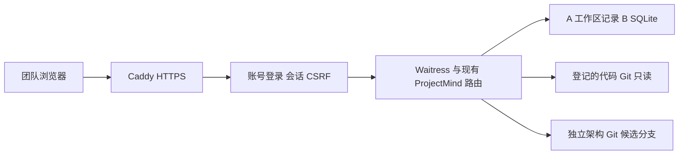

# ProjectMind 团队 HTTPS 入口

状态：本地生产服务与 HTTPS 闭环已验证；**尚未部署到公网**。
当前目标是给同一个团队提供共享工作台，不是多租户服务。
所有登记账号均可读写团队工作区；人审的预览、确认和发布仅由创建预览的同一浏览器会话完成。
另一浏览器可以读取同一版本，也可以重新建立自己的预览；不能接用别人的批准。

## 运行形态



应用后端固定监听 127.0.0.1。代理保留准确的公网 Host/Origin；不改写成 localhost。
账号身份由服务器会话产生，客户端 JSON、X-Forwarded-User 等头不产生操作者身份。
TLS 入口与应用同机，当前只运行一个应用进程；A 的 JSON 锁和浏览器会话尚不是跨进程共享存储。
启动入口用内核文件锁阻止第二个服务进程同时使用同一数据根；退出后允许重新启动。
不使用 `python app.py` 作为公网后端；它仍是原本的本地演示入口。

## 一、准备 Linux 服务器的固定目录

当前公网模式要求 POSIX 文件权限；Linux 是部署目标，macOS 用于本地验证。
Windows 本地演示不受影响；Windows 公网模式需要后续专门验证 ACL。

| 目录示例 | 内容 | 权限/持久化 |
|---|---|---|
| /opt/projectmind/app | 固定应用版本 | 应用运行用户只读；记下提交/树 |
| /opt/projectmind/venv | Python 与 requirements-deploy.txt | 服务依赖 |
| /etc/projectmind | runtime.json、accounts.json | 私有目录；账号文件 0600 |
| /srv/projectmind/code/target | 完整代码 Git 副本 | 代码证据只读；保留所需提交历史 |
| /var/lib/projectmind/architecture | 独立架构 Git 副本 | 专用 architecture/candidates/* 分支 |
| /var/lib/projectmind/state | A JSON 与 B SQLite | 0700；升级应用不能清理此目录 |

服务器上用常规 Git 授权获取私有仓库，凭据放 Git 的正常凭据机制。
不要把令牌写入 remote URL、源文件、浏览器或运行证据。
本轮本机拿到全部校验过的源文件树，但 Git CLI 尚未认证；这不是完整上游历史 clone。

## 二、安装和配置

在应用目录的 Python 环境中：

```sh
python -m pip install -r requirements-deploy.txt
```

复制 `deployment/config.example.json` 到源代码工作副本外的私有位置，填写真实值。
`publicOrigin` 为准确的 `https://域名`，默认端口省略 :443；它与 Caddy 域名必须一致。
没有代码的规划模式允许 codeRepositories 为空。
每个来源登记一个代码副本；浏览器使用以 codeRepoId 为依据的稳定登记键，不能提交任意服务器路径。
架构仓库须独立于代码副本，在干净的 architecture/candidates/* 分支上配置 Git 提交身份。

交互式创建首个账号，不提供默认密码，不把密码放命令行：

```sh
python -m deployment.server create-account \
  --file /etc/projectmind/accounts.json --username wanghaining
```

为其他成员增加独立账号：

```sh
python -m deployment.server add-account \
  --file /etc/projectmind/accounts.json --username teammate
```

密码至少 16 个字符，服务器只保存带随机盐的 PBKDF2-SHA256 哈希。
add-account 原子写入并保留既有账号；新增账号在重启后生效。
服务内存会话最多 128 个、有效期 1 小时；退出登录失效，重启后需要重新登录/预览。
这不是已验证的 MFA、企业 SSO 或细粒度工作区角色系统。

## 三、启动应用和 HTTPS

```sh
python -m deployment.server serve \
  --config /etc/projectmind/runtime.json --port 8765
```

当前使用 Waitress 3.0.2：8 个工作线程、64 个连接上限、16 KiB 请求头、1 MiB 请求体上限。
各业务接口仍保留自身更小的限制。代理头不用于覆盖真实 socket peer 或登录身份。
配置不完整、目录权限不合适、B 后端未接入时拒绝启动。

使用 Caddy 2.11.7 或经重新验证的后续版本：

```sh
PROJECTMIND_DOMAIN=你的真实域名 caddy adapt \
  --config deployment/Caddyfile --adapter caddyfile --validate
PROJECTMIND_DOMAIN=你的真实域名 caddy run \
  --config deployment/Caddyfile --adapter caddyfile
```

真实域名解析到服务器，并按 Caddy 自动证书流程开放所需入口。
仅开放 HTTPS/证书所需入口，不公开应用的 8765 后端端口。
`deployment/projectmind.service` 提供 Linux 单进程守护模板；创建对应服务用户与目录后再启用。
此模板的 systemd 实机启动、云防火墙、真实证书续期本轮尚未验证。
模板只允许写 /var/lib/projectmind；旧本地图模式中存于代码 .git 的扩展状态另需迁移/配置，不能直接声称也已线上可用。

## 四、持久化与恢复

- 应用更新使用新版本目录，保留 A/B 数据和架构 Git；不要 reset/clean 数据目录。
- 当前冷备方式：先停止写入与应用服务，再一起保存 state 和 architecture（包括 .git）。
  不要单独复制运行中 SQLite 主文件并忽略 WAL/事务状态。
- 账号文件和模型 API 环境配置另作私有备份；备份文件不能放入产品 Git 或公开下载目录。
- 恢复到新的私有目录，校验 SQLite integrity_check、A/B 记录、架构 Git 对象和固定版本。
  同机恢复已验证；换机须重新获取对应代码历史、核对仓库身份与路径绑定。
- 所有旧浏览器授权在重启后重新建立；恢复数据不恢复真实登录授权。

本轮冷备夹具恢复了两份工作区：B documents 与源副本相同，SQLite integrity_check=ok，
A 工作区可重开且 mapRevision/mapSourceRevision 不变，架构 Git HEAD 相同。
该证据不是云灾难恢复或跨机器验收。

## 五、本轮证据与上线前剩余验收

实际运行了 Waitress CLI + Caddy 本地 TLS：Python 客户端验证了自建 CA 的证书链与域名。
已有项目与 planning 均完成规则候选→应用草稿→模拟人审→实际架构 Git commit→另一会话同版读取。
登录、CSRF、错误 Origin、跨会话确认/发布拒绝有真实请求证据。
规则输出明确为 rule_based；没有调用真实模型，没有批准真实团队项目认知。

Chromium 的本地启动被 macOS MachPort 权限限制拒绝，**浏览器交互验收仍为 NOT_RUN**。
目前只有 JavaScript 语法检查与 HTTP/HTTPS 路由证据，不能把它写成浏览器测试通过。
源文件树快照不含完整上游历史；实际开发提交的本地历史验证与完整上游历史验证分开报告。

实际上线还需：云服务器/域名、真实 HTTPS 证书、浏览器完整交互、不同网络第二设备同版接续、
真实模型配置后的候选闭环，以及新 D/UI 接续和最新审查中未收口项。
当前候选不自动合并 main，也不自动发布正式 Project Model。

## 官方实现参考

- [Waitress 参数](https://docs.pylonsproject.org/projects/waitress/en/latest/arguments.html)
- [Caddy 反向代理](https://caddyserver.com/docs/caddyfile/directives/reverse_proxy)
- [Caddy 请求体限制](https://caddyserver.com/docs/caddyfile/directives/request_body)
- [Caddy 自动 HTTPS](https://caddyserver.com/docs/automatic-https)

Project Model Impact：UPDATE，候选说明见 MODEL_IMPACT_CANDIDATE.md。
