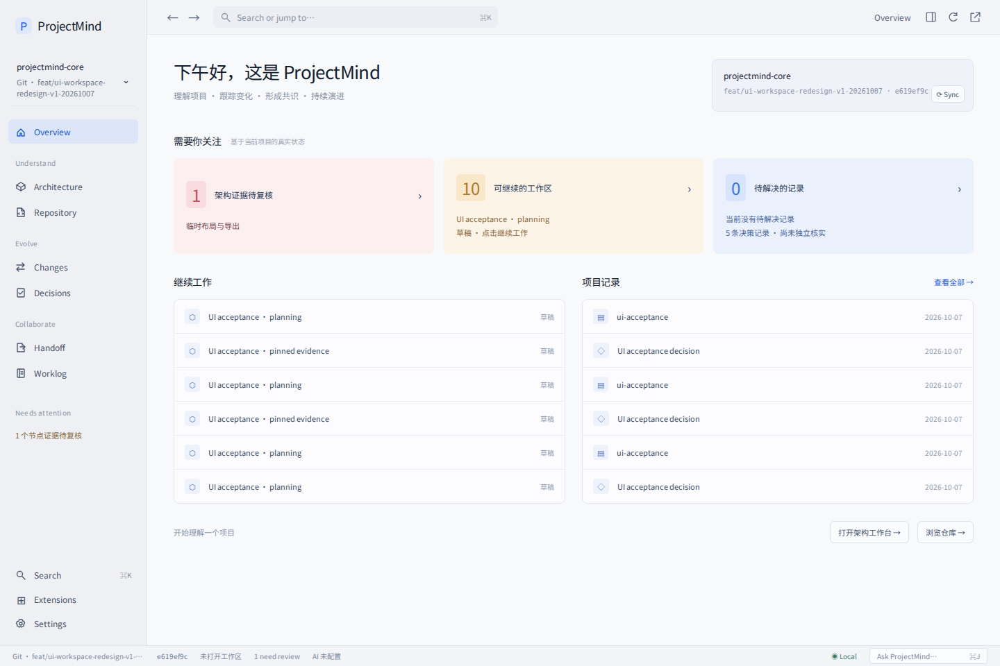
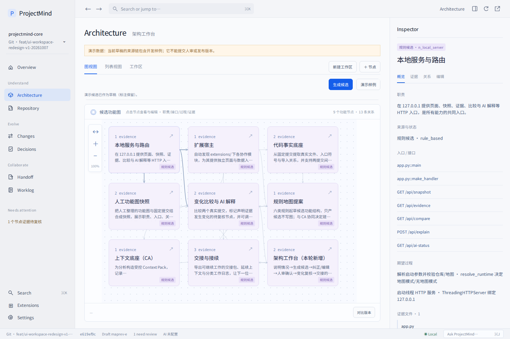
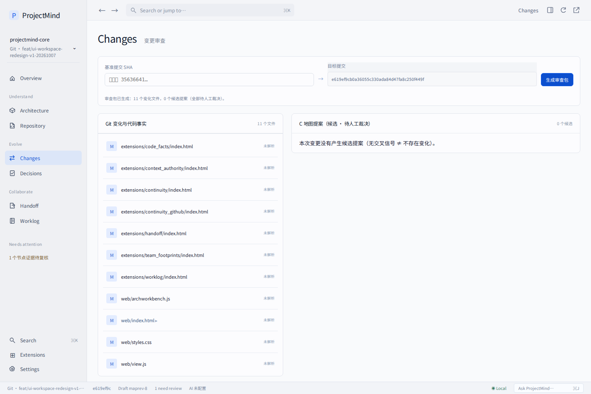
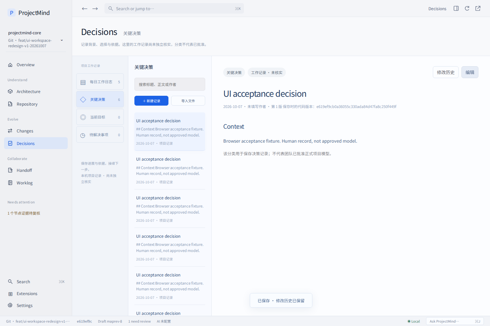
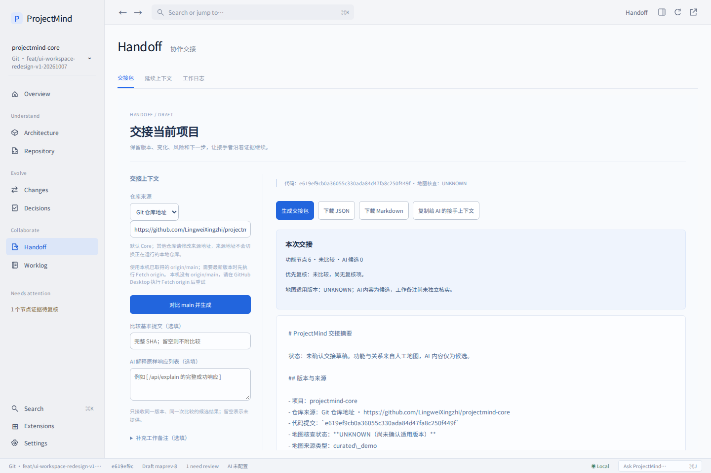
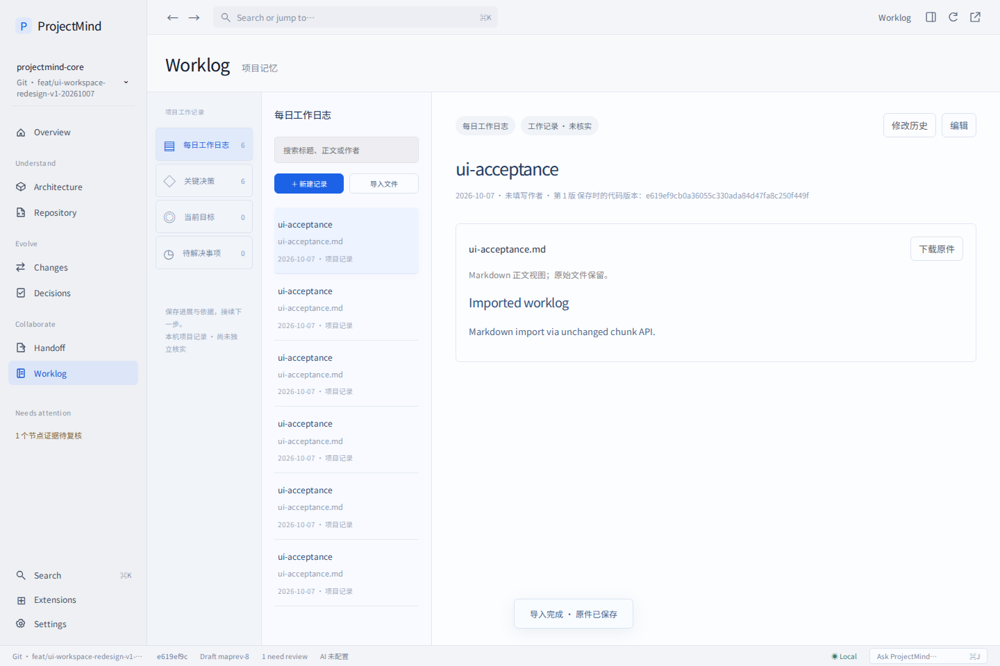
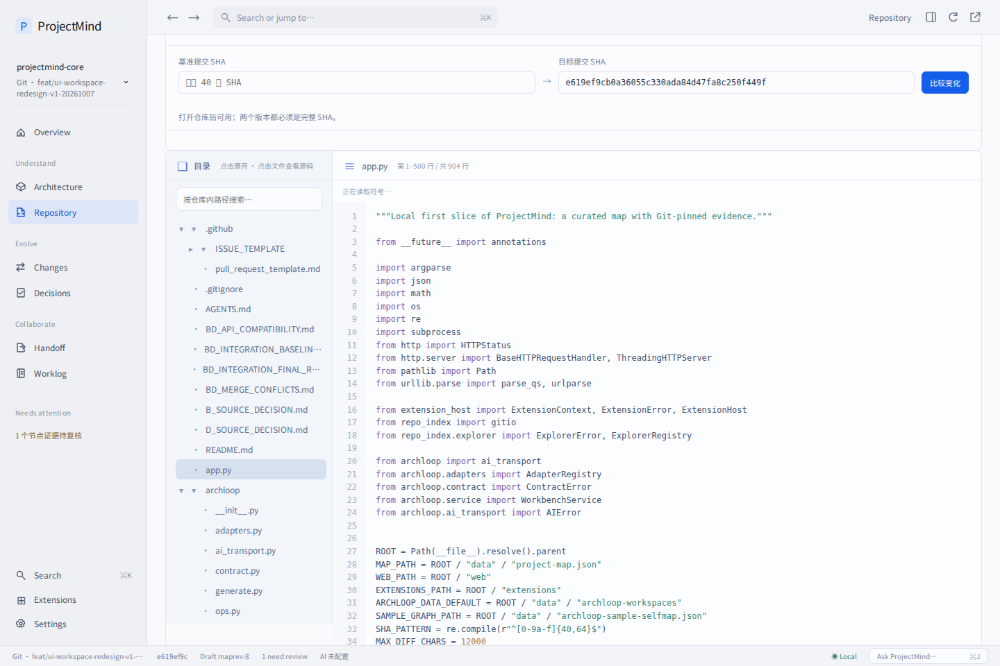
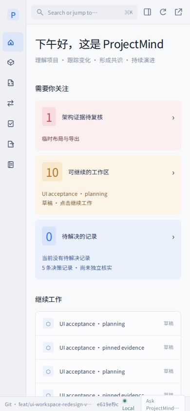

# ProjectMind UI workspace redesign · 2026-10-07

## Result

依据用户最新《ProjectMind 项目管理界面总览.png》重构前端。沿用已经存在的 `feat/ui-workspace-redesign-v1-20261007`，起点 `b75ad820e0d31e3dadf842b414f6950b5aa46102`。所有 Python、HTTP/JSON 接口、扩展存储和人工地图保持原样。

雾灰导航和工作空间、明亮画布、蓝色交互焦点；紫色候选、绿色事实/实现状态、暖色待复核。系统字体、6px 按钮/输入、轻量连线和统一 SVG 图标。页面减少解释和套框，重要来源和限制保留。

- Overview：并行读取快照、工作区历史、日志及 AI 配置；真实提交对比的证据待复核数、可继续工作区、待解决记录、最近日志。失败显示未知/不可用；没有虚构交接收件数量、提交活动或批准状态。
- Architecture：创建流程与日常工作台分开；图/列表/历史工作区、选中关联连线、缩放/适应、画布拖动、节点拖动及本机布局保存、双击编辑、节点弹窗、Inspector 概览/证据/关系/编辑、自然语言纠正预览。人审、删除影响、CAS 冲突和样例来源约束保持原有后端语义。
- Evidence：已有项目的声明证据可跳到 Repository，在工作区绑定的完整提交读取。后端 envelope 不返回本机路径，因此路径仅记在创建该工作区的浏览器；跨浏览器重开时需由用户指定本机仓库。规划工作区不会伪造代码 SHA 或代码浏览入口。
- Changes：紧凑提交比较、单列文件清单、可展开的合法证据链接、B 事实状态、C 候选/不确定性与人工处理项。没有将候选升级成正式架构，也没有实现一个假的“标记已复核”。
- Handoff：上下文侧栏与文档预览；保留 main 对比、备注、原样 AI 响应输入及 JSON/Markdown/接手上下文导出。
- Worklog / Decisions：文档式分类列表、编辑、历史、md/doc/docx/pdf 原有导入和展示；Decisions 是原有 decision 分类的入口，始终声明尚未独立核实，不代表审批系统。
- Repository：目录/源码双栏、符号/关系、固定提交、行号/分页、纯文本安全高亮。没有插入未经转义的代码 HTML。
- Shell：全局搜索（⌘K / Ctrl+K）、键盘选择、页面历史、hash 页面链接、复制链接、状态栏、Inspector 折叠、紧凑偏好、离线显示。扩展仍可独立进入。

## Files Changed

`web/index.html`, `web/styles.css`, `web/view.js`, `web/archworkbench.js`, `web/review.js`, `web/explorer.js`；七个已有扩展的 `index.html`；README、此说明、浏览器验收脚本与截图。

## Verification

- 完整 Python 回归：见 `regression-summary.txt`。
- 真实 Chromium / 原有 HTTP 服务：22 个场景 PASS，0 个页面 JavaScript 异常，详见 [browser-report.json](browser-report.json)。包括创建、样例应用、CAS 编辑、节点弹窗/取消、画布布局、固定提交证据、源码高亮、决策保存、md 导入、交接生成、变化审查、目录/文件浏览、接口失败、小屏、无地图模式。
- 最后补充的证据边界检查：5 项；Repo Explorer HTTP 边界检查：6 项；全部 PASS。
- JavaScript syntax checks 与 `git diff --check` PASS。
- 浏览器场景使用临时记录与明确标记的样例，没有进行真实 AI 生成，也没有产生负责人批准的 Project Model。截图是实际程序运行结果，不是效果图重绘。
- 网络 CLI 无 GitHub 凭据，校验文件从原分支 API 按版本读取，本地生成 verification snapshot + UI commit 供 Git/HTTP 测试；Git 历史相关检查基于该本地 snapshot 历史，不能宣称测试了远端原始完整历史。远端交付使用原始 `b75ad82` tree + 仅本轮文件的 Git objects，保持真实父提交与无关文件。远端变更文件清单单独检查。

### 本机复现

切换上述分支，在仓库根目录运行：

```sh
python3 app.py
```

浏览 <http://127.0.0.1:8765>。默认启动同时提供人工演示图和仓库浏览。原有 `--map` 模式会关闭 Repo Explorer；`--repo` 且不提供 `--map` 是无地图模式，不提供协作记录扩展；UI 保持这些边界。

浏览器验收工具与字体只安装在临时工具目录；产品没有新增 npm 或 Python 依赖。可在单独测试工具环境安装 Playwright，启动两份现有 app 后运行：

```sh
python3 app.py --port 8765 --archloop-data /tmp/projectmind-ui-map
python3 app.py --port 8766 --repo . --archloop-data /tmp/projectmind-ui-nomap
# 在另一终端，使用可访问 playwright 的 Node 环境：
UI_REPO="$PWD" node tests/browser/workspace.cjs
```

可选 `UI_BROWSER` 指定浏览器可执行文件，`UI_OUTPUT` 指定临时截图位置；`UI_FONT_ROOT` 只用于缺少中文字体的校验机。

## Project Model Impact

`MINOR`。改变现有 UI 的组织和表现、读取聚合与页面跳转；没有改变后端模块职责、接口、正式架构或存储格式。未修改 `data/project-map.json`。

## Risks / Follow-up

当前能力边界：交接收件/接收、决策审批、跨对象统一活动、多对象标签、架构编辑 Undo/Redo、共享视图与协同操作均无现有接口支持；本轮没有制造伪功能。AI、正式人审版本、修正任务仍沿用当前基线的可用性与错误语义。`integration/architecture-loop-v2-ZCODE-CLOSE-20261007-1757-K7` 是另一个更晚的后端整合分支，本轮没有把它合入 UI 分支，也没有冒称完成 V2 共存验收；团队整合时应复验。

## Runtime screenshots

数据来自浏览器临时验收记录和已标注开发样例；不是正式团队记录。









