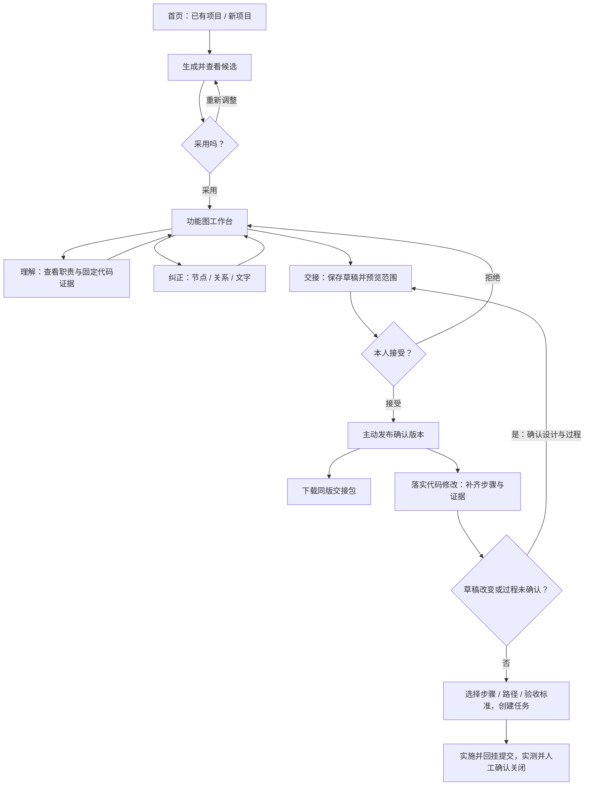

# PR75 用户操作流程交付与自检 · 2026-10-08

## Result

按用户提供的操作图重整既有功能。基线为 PR75 的 `cea6b48567e8749865b9ea1bfc47d62336bb6d66`，对应本地源树 `e1d96d58c9385f4a5260b13d5dc340a80037203d`。本地使用独立工作树，未覆盖队友的副本。

已有项目导入 / 新项目想法 → 查看候选 → 自行采用或放弃 → 功能图工作台 → 理解、纠正、交接 → 保存、核对实际范围、接受或拒绝、主动发布 → 同版交接包 / 实施任务。

本轮侧重可操作性，复用既有候选、人审、版本及任务后端。没有增设 GitHub URL 克隆、网页密钥保存、撤销重做或跨设备接收功能。

### 用户操作

1. 首页选“已有项目”或“新项目”。已有代码填运行服务电脑上的 Git 目录；公网模式选服务器登记的仓库。无效输入给出中文恢复办法。
2. 检查 AI 状态；无配置可明确选择规则起草。候选只在主动采用后进入草稿。重新采用会提醒替换草稿。
3. 采用后收起起草区。选“理解项目”点击节点看职责、接口、期望过程与固定提交源码。
4. 选“理解不对 · 修改”编辑节点、关系或文字纠正。输入在当前窗口跨节点保留；保存失败/版本冲突不丢输入。明确保存才写入草稿。
5. 选“交给队友”保存版本草稿、预览实际职责/关系/步骤/证据及限制，自行接受或拒绝；接受后再主动发布。
6. 发布后生成并下载同版交接 JSON。下载绑定预览版本；另一人发布新版本后，旧下载链接会拒绝而不是默默换成新内容。
7. 选“落实代码修改”，填写步骤和代码证据。编辑已发布图会形成新草稿，须确认“设计与期望过程”并重新发布。只有代码核查的版本不能用于未经确认的过程。
8. 创建任务时明确选择实际步骤、代码路径、差异及验收标准。队友接手、实施、回挂真实分支/提交，经过实测与人工确认关闭。



窄窗口点击节点时直接弹出可关闭的详情面板。保存/错误提示就近显示，“返回功能图”保留未保存输入。

## Files Changed

- `web/index.html`、`web/user-guide.js`、`web/user-guide.css`：意图入口、下一步、折叠起草区、确认/交接/任务分区、窄窗口。
- `web/archworkbench.js`：窗口内编辑缓冲、真实确认内容、任务过程覆盖预检、步骤/路径选择、版本约束下载、历史恢复。
- `archloop/service.py`：导入错误提示；保留仓库登记检查先于路径检查。
- `app.py`：可选 `GET handover?download=1` 返回附件；原 JSON GET 保持兼容。
- `tests/test_workbench_import_ux.py`、`tests/test_workbench_handover_download.py`、`tests/check_workbench_flow_ui.cjs`、相关既有 HTTP/公网测试。
- 本交付记录、实施计划及用户流程入口说明。正式 Project Model 未改。

## Verification

### 后端回归：PASS

实际在 Python 虚拟环境运行以下命令（运行器路径省略，仅命令保留）：

```sh
python -B -m unittest tests.test_workbench_import_ux tests.test_archloop_a_service tests.test_archloop_a_backend_b tests.test_archloop_a_http tests.test_archloop_d_adapter tests.test_archloop_d_fix_tasks tests.test_archloop_c_candidates tests.test_archloop_b_review_sessions tests.test_workbench_handover_download tests.test_public_deployment
```

最终 **114 tests / 27.589s / OK**。覆盖导入边界、A/B 人审、C 规则候选、D 任务、同源/登录/CSRF/生产服务和附件下载。首次运行发现历史断言仍期待无效路径返回 INTERNAL/500，已将该断言更新为明确的 VALIDATION_FAILED/400，并保留该失败输入用例重验。不是本轮重跑整个仓库所有测试。

附件测试包括原 JSON 契约、平铺/嵌套版本结构、no-store、旧版链接冲突、同源拒绝，以及 Waitress 登录后下载。附件传输单元用受控包验证，不把模拟包当作真实 B 批准。

### 前端回归：PASS

```sh
# jsdom 位于验证环境 NODE_PATH；未增加产品依赖。
node tests/check_workbench_flow_ui.cjs
node --check web/archworkbench.js
node --check web/user-guide.js
git diff --check
```

DOM 流程回归使用真实网页脚本和模拟 API，覆盖输入保留、CAS 失败、未保存阻断、确认内容、拒绝/接受/发布分离、第二步骤选择、需求资料不混入代码范围、旧版任务禁用。它不能代替真实浏览器与后端联调。

### 原生浏览器 + 完整本地服务：PASS（隔离夹具）

使用 55418 端口及独立 A/B 数据、架构 Git、可丢弃代码副本，B/D 已接入。实际点击完成：

- 不存在目录的中文提示、有效 Git 导入、规则候选采用/放弃、采用后折叠。
- 节点/关系编辑、切换后保留未保存职责、固定提交源码读取。
- 核对预览、拒绝无版本、再次接受并主动发布。
- 新项目检查未配置 AI、保存目标/约束、规则起草并放弃；返回不误建新项目。
- 选择第二个期望步骤及单独代码路径创建任务。
- 任务接手、开始、回挂夹具真实提交、验证与关闭链路。
- 已发布图修改后明确显示新草稿，任务创建禁用。
- 刷新恢复服务端项目；1280×900 / 430×860 视口检查，无页面横向溢出；窄窗口面板返回正常。恢复浏览器默认视口。
- 控制台 error 数量 0。

任务实测采用明确标记的合成验证器，输出说明它是体验夹具。任务 `fix-54c055ba9358481cca8f0104223081c5`，回挂夹具提交 `c24b4ce554264bbd72ee8a806b818f895c9ce2b7`。仅证明任务生命周期，不证明生产代码验收；该夹具提交不上传。

**交接下载实际落盘**：5810 字节，文件 SHA-256 `dfd01b3ed921c634502bd0cecefd6678349fac079e524fc4468ac7d424c08d97`；
图版本 `sha256:9a584412b2328be361a4118f19d30a8689aab5d6e13a3e841482c5bf11e51c8c`；
架构源提交 `7fce1d5dfff418bcd5baf931976123c26a6887ad`；
固定代码 `95cccff9ee59c41562d352a67734d313f5c4ebb8`。
下载发生在当前草稿已编辑时，页面明确表示导出的是上次确认版本。夹具 JSON、个人路径和运行数据不入库。

真实 AI / 正式团队架构批准 / 公网部署 / 第二台物理设备接收：**NOT_RUN**。

## Project Model Impact

**MINOR**。

依据：README 的两种入口、候选、人审三步及任务版本边界；`archloop/INTEGRATION_ROUND3.md` 的既有接线；`docs/standards/AGENT_STANDARD.md` 的“AI 提议、人确认”；用户最新操作图。

内部交互和错误处理变化，模块职责、确认权威、代码/图版本和任务边界保留。附件增加可选传输参数，不改变正常 JSON 客户端契约。不发布正式 Model。

## Risks / Follow-up

- 当前窗口未保存输入不是持久化草稿；刷新/退出会提示，用户明确离开后输入仍会消失。须点击各编辑器保存。
- 导入仍需要本地 Git / 服务器登记仓库。网页不能直接克隆 GitHub URL。
- 规则候选只根据已有资料起草，人工仍需整理职责；真实 AI 尚无本轮体验证据。
- 规划图与后续代码绑定、跨设备交接接收、网页保存 AI 设置等后续能力未在这轮实现。
- 本轮服务端写会话、登录、CSRF、CAS、预览覆盖、人确认发布仍保留；没有改成自动审批。
- 本地代码由远端精确树快照构建，具有合成历史，不冒称完整上游 Git 克隆。
- 成果更新到 PR75 的独立分支，继续保持 Draft；main 合并和真实架构批准由团队决定。

