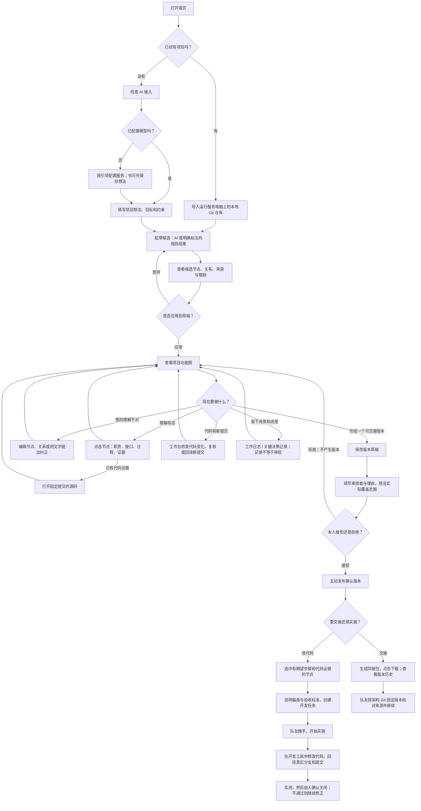

# 用户使用流程与 UI 修改结果 · 2026-10-08

## 当前交付：PR75 操作流程重整

最新结果与回归证据见 [PR75 用户操作流程交付与自检](PR75_FLOW_DELIVERY_2026-10-08.md)。本轮按用户操作图补齐三种工作意图、输入保留、真实确认范围、任务步骤选择、窄窗口详情和实际附件下载。发布后补步骤需重新确认设计与过程。旧版 PR71 的验证及“未上传”等状态只属于下方历史记录，不能用于判断当前 PR75。

## 历史记录：PR71 首轮体验改进

## Result

把 PR #71 的现有功能串成两个起点、一个功能图工作台：已有项目导入；新项目先检查 AI 接入再记录想法。两条路径都经过候选预览、人工应用、查看与修改、明确的版本确认、交接和实施跟进。

依据根目录《ProjectMind_产品意图与待确认问题.md》和 `projectmind-model/docs/PROJECT_ANALYSIS.md` 的产品意图，以及当前 README、工作台实现和用户最新指示。前者含历史 MVP 内容，后者属于产品分析草案；它们不是对所有功能已实现或对正式架构已批准的证明。这里描述本次代码事实与 UX 建议，没有修改团队正式模型。

从 PR #71 的 `2689f5c19cd7bf2265d4bb3c02c85070d08abcf4` 建立独立分支 `ux/user-flow-guidance-20261008`。另一轮 PR #70 集成不在本次改动范围。

## 用户会怎么使用

AI 节点表示已存在的调用入口，真实生成与纠正本轮 **NOT_RUN**：没有配置模型。规则结果只有候选性质；本轮规划规则结果将目标和约束转成节点，已有项目规则结果按代码模块聚合，仍需要人工整理功能职责。它们不能替代真实 AI 分析的体验验收。

新项目目前可以保存想法、生成规划候选、编辑和确认设计。**将规划图与后来产生的代码接起来，没有本轮已验证的普通用户主界面入口**，不能把这条后续能力画成已完成。

“协同交接”导航里的旧文档导出与工作台的同版架构交接包仍是两种既有入口。本轮主流程使用工作台的同版包。第二设备的实际接收和导入未验收；没有制造一个假的“队友已接收”。

## 本轮已落地的 UI 修改

| 用户要做的事 | 本次结果 |
| --- | --- |
| 第一次打开，不知道从哪里开始 | 空项目首页弹出两个起点；首页一直保留“开始 / 添加项目” |
| 已有代码，想导入 | 明确要求本地 Git 目录、运行服务的电脑、已提交代码；填写项目名称与情况说明 |
| 只有想法 | 先显示真实 AI 接入状态，再填写目标与约束；未配置时只记录想法，不冒充完成生成 |
| 不知道下一步 | 当前项目上方显示依据实际状态的建议；步骤栏只指示当前位置，不勾选未确认事项 |
| 生成后不知道改了什么 | 候选摘要在生成按钮下方显示节点、关系和限制，再由用户应用或放弃 |
| 找不到节点编辑 | 画布上方直接提供“编辑节点”“用文字纠正”，选中节点即可使用 |
| 找不到关系编辑 | 画布上方直接提供“编辑关系”；点击连线或连线中间的编辑按钮，直接展开对应关系 |
| 要改方向、类型、说明 | 现有关系可一次保存，复用已有 CAS 操作批次，原子执行移除与新增；没有新建后端协议 |
| 不理解拖动效果 | 明确标注拖动只是查看布局；编辑保存才改变草稿 |
| 保存、确认、发布混淆 | 分离候选应用、草稿保存、确认预览、接受/拒绝、主动发布；切换项目或成功编辑后清除旧的确认按钮 |
| 要交给队友 | 发布后主建议变为生成同版包；显示版本信息与可见下载链接，生成不冒称已经落盘 |
| 想让队友改代码 | 用可展开的实施入口说明前置条件；当前图未发布时禁用任务创建；直接跳到期望步骤和证据编辑 |
| 在不同项目间操作 | 左上方显示当前工作区的项目身份；导入项目不会继续显示 ProjectMind 服务源码仓库作为当前项目 |
| 误入人工演示图 | 显示查看/布局边界与“打开可编辑工作台”；首页旧演示图统计单独标明来源 |
| 手机上看不懂图标 | 320/390 像素宽度保留中文导航，并修正页面横向溢出 |

## 最终 UI 改版内容

以下是下一次整体页面整理的明确目标，**不是本轮全部已实现**。

1. **首页**：保留两个起点与继续项目；以用户的项目为主，旧人工演示统计和服务代码信息放到“示例/高级信息”。不要再用多个重复欢迎区和大段开发说明占据首页。
2. **导入**：增加受支持的选择仓库/准备仓库入口，避免让普通用户复制本地绝对路径。当前没有 GitHub URL 直接导入、ZIP 导入或任意文件夹自动变 Git 的体验；需有真实实现再开放。
3. **AI 接入**：提供真实可保存并检测的配置入口。当前本轮实现的是状态检查与运行者配置说明，尚不能在网页里保存 API 设置；公共部署时应区分使用者与配置服务的人。
4. **功能图**：让图占据主要空间。生成区在有图后折叠到“重新生成”；下一步提示保持紧凑。编辑职责、关系、证据与过程用就近的抽屉/表单，减少长详情面板滚动。直接关系编辑已可用，拖出新线、端点拖拽、Undo/Redo 尚未实现。
5. **纠正预览**：集中显示修改前后对照，并明确“只改理解”或“创建实施任务”。普通用户不需要先理解 A/B/C/D、CAS、adapter 或枚举。
6. **版本确认**：用独立的确认步骤页展示实际覆盖对象、依据、未知项与限制。按钮保持人工主动操作；不能将未看过的范围默认标为通过。技术摘要折叠，版本来源可展开核对。
7. **团队交接与任务**：将同版包、未解决偏差、任务进度放在当前项目的协作页。任务分角色给出一个明确动作：接手、提交实施结果、核验、确认关闭。旧文档交接入口放为附加资料；收到交接包、跨设备接收需要真实支持后再开放。
8. **持续变化与记录**：当前项目的代码变化、影响候选、任务、日志和决策应围绕同一项目组织。当前旧版全局变更审查/记录页面不是统一绑定当前工作区的完整项目视图；普通用户主流程先使用工作台的“检查代码变化”。

优先完成 1/4/6/7 的页面组织，再做 2/3 的接入能力。颜色、间距与图标统一放在这些流程明确之后。后端确认、身份和版本边界保持现有契约。

## Files Changed

- `web/user-guide.js`、`web/user-guide.css`：入口选择、接入说明、下一步与就近操作、窄屏样式。
- `web/index.html`：主入口、候选预览容器、编辑操作、确认/实施分区、演示边界。
- `web/archworkbench.js`：复用原编辑操作；关系替换、直接连线入口、确认状态清理、交接下载链接。
- `web/view.js`、`web/app.js`：项目身份展示，区分演示统计。
- `app.py`：仅增加两份静态资源路由。
- `tests/browser/workspace.cjs`：适配新增入口弹窗与折叠的演示样例；本轮没有运行这份历史浏览器脚本。

## Verification

使用新建的本机独立实例和两套 `UX_TEST_ONLY` 数据，浏览器实际走过导入、规划、规则生成、候选应用、节点修改、关系添加及方向/类型/说明修改、固定提交源码查看、保存版本草稿、预览、拒绝、接受、发布、同版包生成、任务创建与列表。测试不会替负责人批准真实项目架构。

补充实际核对：刷新后历史可继续；点击最终连线编辑按钮直接展开对应表单；切换工作区隐藏上一项目的待发布按钮；320/390 宽度页面无横向溢出；修复初测新建入口空状态事件导致的一次脚本异常后，最终浏览器日志没有脚本 error。

相关 Python 回归 **111 项通过**（80 + 31）；JS 语法检查与 `git diff --check` 通过。不是重跑此前全部 1046 项。

**未验证项**：真实 AI 生成/纠正、真实团队的最终内容确认、第二设备的接收与继续、公共部署。交接 JSON 的 HTTP 结果及版本指针有独立核对；内置浏览器点击下载没有提供可观察的下载事件，本轮不把浏览器文件落盘写成 PASS。

## Project Model Impact

`MINOR`。调整既有 UI 组织与操作可达性，复用既有写会话、CAS、版本确认和 D 任务接口；不改变后端职责或契约。未修改正式架构图或团队确认的 Project Model。上述后续改版目标属于 UX 建议。

## Risks / Follow-up

本次是 PR #71 上的独立体验改进分支；尚未合入另一个正在集成 PR #70 的副本，未推送 GitHub、未修改 main。合入最终集成版本后需对相同用户流程再验收。没有开放尚不存在的导入、API 网页保存、规划绑定代码、撤销/重做或跨设备接收功能。
