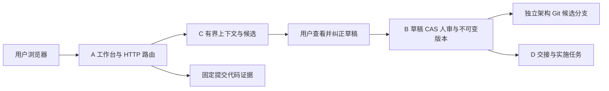

# 最新完整项目复查

日期：2026-10-08。性质：代码事实复查与部署协调材料，不是批准后的 Project Model。

本文件记录转为整项目开发前的 B 检查阶段。用户随后取消 ABCD 写入限制；
当前整项目运行入口与后续验证见 docs/deployment/README.md，不能把下文旧源的限制当作最新候选能力。

## 依据与边界

- 用户 10 月 7 日任务书：事实底座复用，补齐可编辑的功能认知、人审版本、实施修正与同版接续。
- 最新整合：`integration/architecture-loop-v2-ZCODE-CLOSE-20261007-1757-K7`，
  `803c6736d1ab01bee004a77c2d2b3b140b28cb12`。
  完整树 `dba0238e1fba1b453fb6b3f803d71ab7fd37b4c1`，249 个文件逐个校验 Git blob，
  140 个 Python 模块做静态定义/导入清点；静态清点不代替运行验证。
- `main` 仍为 `7484d44ddeac3c054ca3ba68f92293d965bb615c`。整合成果与 main 的状态分开报告。
- B 的本轮增量在 PR #51；部署增量在同一 B 分支。没有回写整合分支、main 或其他 owner 文件。
- `projectmind-model` 当前可读取的 main 树仅有两行 README；没有协作文件引用的
  `docs/PROJECT_ANALYSIS.md` / `docs/drafts/PRODUCT_INTENT.md`。
  这些正式来源仍待负责人提供，不能把旧规格提案或此文档当作批准后的项目综述。
- `COLLABORATION_CONTRACT.md` / `MVP_INTERFACES.md` 的实施状态部分停留在 9 月阶段。
  它们仍提供边界原则；最新能力判断以固定代码和本轮任务书为据。

## 当前实际形态



这张图表达协作方向。最新 D 版本的公共接线仍有缺口，不能由箭头推断已完成整体接入。

| 部分 | A803c 中实际存在的能力 | 本次核对后的状态 |
|---|---|---|
| A 工作台 | existing_project / planning / mixed、说明与候选、编辑/审阅/版本路由、原仓库浏览与证据下钻 | 实现存在；真实 AI、最终 UI、远程第二设备闭环仍需验收 |
| B 认知后端 | `archloop/backend_b.py` 委托真实 WorkspaceService/Gateway；SQLite、CAS、人审、Git 版本 | 已接入较早 B；最新候选选择预演、双面接口和会话容量改进在 PR #51，需 A 追加接入 |
| C 候选 | `archloop/backend_c.py` 委托 map_proposal；初图、自然语言补丁、增量及偏差；有界 Git 上下文 | 规则候选与 AI 状态区分；未配置模型不算真实 AI 验收 |
| D 旧底座 | Handoff / Continuity / Worklog 扩展；A 有兼容交接与 FixTask 门面 | 旧能力已经整合，不能笼统说 BCD 未集成 |
| D 新治理 | PR #54 的 architecture handoff、FixTask 版本 Gateway | 相应新运行模块不在 A803c；B 与真实 D 的组件演练已做，但不等于 A 路由已接入 |
| UI 更新 | 当前整合有工作台；PR #56 的后续 UI 改版另在分支 | 不把独立 PR 的页面当成当前整合页面 |
| 公网 | 主入口和读写边界固定本机来源 | 实际 HTTP 预检确认公网头被拒绝；还没有公网部署 |

### 需要保留的身份含义

`codeRepoId` / `mapId` / `codeRevision` / `mapRevision` /
`mapSourceRevision` / `verifiedCodeRevision` 是不同字段。
规划图允许没有代码 SHA；Git 图提交不证明团队核查了全部代码。
新 D 消费正式 B mapRevision，不能把 A 临时 `maprev-*` 草稿摘要直接当正式版本传入。
A↔B 转换承担字段保留，不能由 C/D 各建一套持久化或批准逻辑。

## 本次最新整合运行证据

从全文件校验的 A803c 快照运行：

```text
TMPDIR=/private/tmp PYTHONDONTWRITEBYTECODE=1 python -m unittest discover -s tests -v
Ran 800 tests in 188.674s
FAILED (errors=1, skipped=23)
```

776 项通过，23 项跳过，1 项错误。
唯一错误是 `test_w6_smoke.RealDiffSmokeTests.test_end_to_end_on_real_history` 的 setUp
请求 `HEAD~1`，而当前 API 下载的快照只有一个用于测试的合成 Git 提交。
其源文件树与 A803c 一致，但上游历史未克隆，不能声称该真实历史用例通过。
保留失败记录；没有伪造父提交、删除测试或改写其他 owner 测试来转成绿色结果。

这次 800 项不是旧 B 分支 759 项的重复标签。
旧 B 全回归、A↔新 B 的 97 项、真实 D 的组件验证各自有固定范围和日志，
见 `CONTINUATION_DELIVERY_2026-10-08.md`；这些计数有交集，不能相加当独立验收总数。

## 最新审查的残留

PR #58 固定基线 A803c，记录 `CHANGES_REQUESTED`：2 项 P1、4 项 P2。
本次读取其审查记录和对应 source，不把历史 PASS 迁移成新 SHA 的批准。

| finding | 范围与责任 | 处理状态 |
|---|---|---|
| GEN-01 P1 | A context_pack 的复合缩写密钥名识别，如 clientAPIKey | 交 A 核对；当前 B 不改公共上下文过滤 |
| G-02-RUNTIME P1 | 仓库外 controller 的后处理变量、schema fallback watchdog | controller 维护者处理；不是 B 运行模块 |
| G-02-STOP P2 | controller 快速退出与租约复查 | 同上 |
| G-02-RETRY P2 | controller fencing 失败后的 RUNNING 状态 | 同上 |
| G-02-RELEASE P2 | controller 租约读删竞态和无租约释放 | 同上 |
| ACCEPTANCE-01 P2 | T24 的 response version 缺少独立本地 HEAD 对照 | 验收工具 owner 补独立证据 |

此表转述最新未收口项，不表示本轮独立复现了全部六项。
真实 AI T01/T23、新 D 接线、UI #56、跨设备同版验收还不能宣称完成。

## 本轮可以独立完成的部署准备

1. B 增加只读预检，保持目标 Host/Origin，检查实际 A 根接口与 B 状态接口。
2. 实际通过 `app.py` 启动隔离完整项目，登记新建代码/架构夹具与各自数据根。
3. 对响应仅保存状态、已知错误码和布尔可用标记，丢弃路径、模型名及授权信息。
4. 输出本机阻塞证据、可复查启动说明、持久化清单和待 A 协调事项。

公网登录、公共路由配置、D Gateway 绑定属于共同接线。
没有服务器/域名且用户本轮明确只要求部署准备，本次未创建公网入口。
具体步骤见 `PUBLIC_DEPLOYMENT_PREPARATION_2026-10-08.md` 与 `DEPLOYMENT_LOCAL_RUNBOOK.md`。

## Project Model Impact

本轮增量为 **MINOR**：B 内部诊断与交付材料，职责和现有请求权限不变。
正式模型缺失需要补证据；公网身份/代理方案是待协调提案，未写入正式 Project Model。
