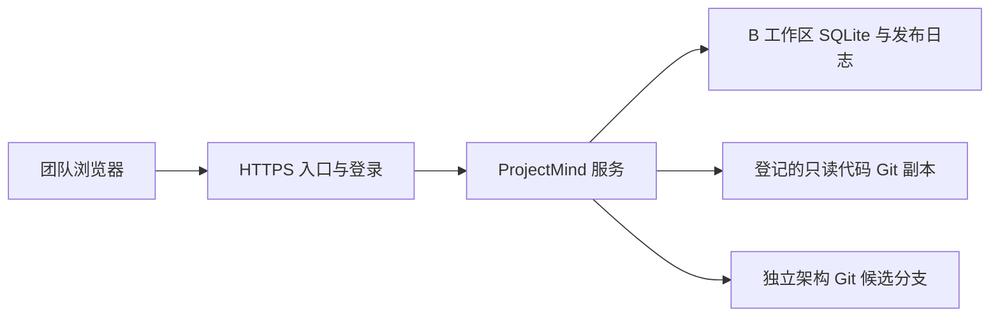

# ProjectMind 公网部署准备方案

日期：2026-10-08。状态：DEPLOYMENT_PROPOSAL / NOT_DEPLOYED。
依据：用户新增公网连通性要求，以及固定整合提交
803c6736d1ab01bee004a77c2d2b3b140b28cb12 的实际代码。
本文件是协调方案，不是已获批准的公共接口，也不是部署成功记录。

## 推荐首期形态

一个持续运行的 Linux 云主机，一个 HTTPS 域名，同一实例保存工作区数据。
团队浏览器经登录后访问工作台；后端读取服务器登记的代码 Git 副本，
B 将认知版本写到单独架构 Git 副本的 architecture/candidates/* 分支。

公网访问对象是运行中的服务。上传源代码仍需另行在服务器启动服务并配置数据。
网页展示、人审保存、Git 发布和第二客户端同版读取都要逐项验收。

## 当前代码的具体缺口

| 位置（固定 A803c） | 当前实际行为 | 公网所需工作 | owner |
|---|---|---|---|
| app.py main | 监听 127.0.0.1；没有部署参数 | 保留内部监听，通过可信 HTTPS 入口接入；配置外部来源 | A |
| app.py _explorer_access_allowed | 仅接受 localhost/127.0.0.1 Host 和本机 HTTP Origin | 对配置的准确公网域名/HTTPS Origin 校验；覆盖读与写 | A |
| app.py _review_meta | 来自实际 socket 与 Host/Origin | 明确受信代理与登录身份；不能采信任意客户端 forwarded 头 | A |
| B HumanReviewGateway | 仅允许 loopback HTTP origin；本地 actor 是声明 | 协调公网会话绑定与受信传输边界；保留 CSRF、过期、预览绑定、精确事务 | B 与 A |
| A WorkbenchService review_preview | 工作区内存储服务端会话，尚无浏览器登录会话 | 每个浏览器/操作者的真实会话；防止不同用户共享审核授权 | A |
| 工作区创建/导入 | 使用服务器本地 repoPath | 用户选择服务端登记仓库；不让公网用户任意读取服务器路径 | A/C/D 协调 |
| SQLite、A 记录、架构副本 | 在指定本地数据根持久化 | 持久卷/固定目录、文件权限、备份及恢复 | 运维、A/B |
| ThreadingHTTPServer | 当前是本地 demo 的 HTTP 服务 | 为常驻部署提供合适服务入口、请求限制、进程守护与日志 | A/运维 |

反向代理转发后 TCP peer 可能是 127.0.0.1；这不能证明请求者是本机操作者。
不能把公网 Host/Origin 改写成本机值来绕过现有校验，也不能取消校验后宣称完成部署。

## 实施顺序与验收

1. **确定发布基线和资源**：负责人选择整合 SHA；配置云主机、域名、登录提供方与团队账号名单。
   首期用一个应用实例，避免当前内存会话跨多 worker 不一致；多实例需单独设计。
2. **A/B 冻结公网请求边界**：明确 external origin、代理地址、浏览器会话、CSRF、
   操作者 identity/role 的服务器来源、工作区权限；C/D 不持有人审发布权限。
   登录与 HTTPS 不能代替图/草稿 CAS 和人工确认。
3. **完成公共接线**：A 改主入口与路由，B 实现批准后的 Gateway 适配；
   D 的 FixTask Gateway 同时核对来源和会话。保留本地模式，公网模式必须显式配置。
4. **部署运行材料**：生成固定版本的启动/服务配置，安装 Python/Git；
   代码副本只读，架构副本只允许认知候选分支；所需 Git 凭据按服务器最小权限配置。
   不使用浏览器凭据，不将令牌或 API Key 放入 PR、前端或运行证据。
5. **上线 HTTPS 和登录入口**：域名解析到服务器，入口证书和续期、进程守护配置实际运行。
   Caddy 可承担 HTTPS/反向代理；登录可由批准的应用会话或身份网关承担。
6. **真实公网验收**：
   - 不同网络的第二台设备打开 HTTPS 域名；前端和 API 都可达。
   - 未登录读取/写入拒绝；错误 Origin、伪造 forwarded、错误 CSRF 和跨用户批准拒绝。
   - 生成候选、编辑重开、两客户端 CAS、人审确认、真实架构 Git commit。
   - 导出与第二 clone 的六字段固定版本引用一致；planning 仍无伪造代码 SHA。
   - 重启后持久数据可读；内存授权消失按当前能力如实显示恢复状态。
   - 发布失败不显示成功；备份与恢复流程实际验证，代码工作区没有被修改。

## 临时远程演示选项

Cloudflare Tunnel 可以把本地服务连到一个公网域名，并可配合 Access 限定团队访问。
但当前应用仍有固定本机 Host/Origin 与会话限制，必须先做相应适配。
电脑或服务停止、睡眠断网后，该路径也会停止；正式常驻部署使用持续运行的服务器。
本轮没有创建 tunnel、配置云主机或开放公网端口。

## 本轮 B 已能独立推进的内容

- 会话回收/容量限制：防止长期运行无限积累；这是本地 Gateway 硬化，不是公网登录。
- 受保护的候选选择预演：保存前验证固定证据与图结果；预演不批准。
- 持久化、CAS、不可变版本、发布恢复已有测试；要在最终服务器再验证文件系统与 Git 环境。
- A803c 与新 B 的隔离接续验证，不能代替已部署公网验证。

## 官方参考

- [Caddy 自动 HTTPS](https://caddyserver.com/docs/automatic-https)：域名解析、端口与证书管理条件。
- [Caddy 反向代理](https://caddyserver.com/docs/caddyfile/directives/reverse_proxy)：代理与受信 forwarded 配置。
- [Cloudflare Tunnel](https://developers.cloudflare.com/tunnel/get-started/)：公网域名到本地服务。
- [Cloudflare Access 自托管应用](https://developers.cloudflare.com/cloudflare-one/access-controls/applications/http-apps/self-hosted-public-app/)：登录与访问策略。
- [Python http.server](https://docs.python.org/3/library/http.server.html)：当前 demo 服务不适合作为生产部署入口。

Project Model Impact（当前实现）：MINOR。公网权限/角色方案为待确认建议，正式 Model 未修改。
