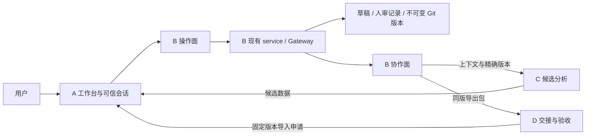

# B 两侧接口重新设计 · V2 候选

日期：2026-10-07。用户明确范围：**B↔A 与 B↔C/D**。
状态：DESIGN_CANDIDATE / A_REVIEW_PENDING / NOT_IMPLEMENTED。

这份文档重新组织 B 的对外调用方式；现有七个 service 入口、Gateway、V1 图包和运行行为保持兼容。
新方法名、请求包装、发布会话包装和候选数据协议是待实现设计，公共 HTTP 由 A 冻结。

## 1．设计目标

**操作面负责把用户决定保存成版本；协作面负责传递候选和同版数据。两面共用一套身份、校验、存储和版本事务。**

当前同一个 WorkspaceService 包含读取、草稿编辑、上下文推进、Git 导入和人审发布。
调用者要自行组合多组 ID/版本/令牌，A/C/D 的职责主要通过文档约束。
重新设计要解决三件事：

1. A 使用按用户动作组织的接口；人审与发布都经过可信会话检查。
2. C/D 使用受限的消费接口；生成或导出数据不取得审核/发布能力。
3. 相同上下文只组织一次，旧版本、当前代码和核查范围始终能区分。

不增加另一套数据库或正式图，也不把 Python facade 当成多用户认证系统。

## 2．整体结构



C 把候选交给 A 展示，用户选择后由操作面写草稿。
D 提交导入申请，由 A 经过来源与会话校验后导入本机工作区。
A 必须将目标工作区的 mapId/codeRepoId/codeRevision 与实际 Git 包比对；
申请里的 verifiedCodeRevision 只是期望值，实际核查字段从固定版本包读取。
底层 service 只保留在受信服务端组合层；后台 worker 取得受限接口或 RPC，不接收原 service/Gateway/存储实例。
同一操作系统账户的任意代码执行不在 facade 的隔离保证内。

## 3．第一面：B↔A 用户操作

候选接口对象名：`UserWorkspaceAPI`。由 A 的受信请求适配器调用。

| 用户动作 / 方法候选 | 输入重点 | 输出重点 | 复用 / 待实现 |
|---|---|---|---|
| openWorkspace | 已登记 repository 引用或 planning；mode | workspace context、当前正式版本引用 | 复用 open_workspace；可信包装待实现 |
| prepareDraft | context、初图或历史版本、proposalId/origin | draft、更新后的 context | 复用 create_draft |
| readView | workspaceId，可选 draftId / 精确版本 | 当前代码、正式版本、草稿、待复核信息分别返回 | 组合 get_draft / graph_snapshot / get_version |
| saveDraft | context、proposalId、操作、候选选择记录 | 草稿 revision、实际 appliedOperations、新 context | 复用 apply_draft_operations；选择映射校验待实现 |
| previewReview | context、理由、coverage、verifyCode、拒绝项 | 实际 before/after、操作、previewId、digest、过期时间 | 复用 Gateway.preview_review；不向协作面暴露令牌 |
| confirmReview | previewId、digest、accept/reject、可信会话 | reviewId、决定、发布是否可继续 | 复用 Gateway.confirm_review；授权句柄包装待实现 |
| publishVersion | draft 引用、reviewId、原版本条件、可信会话 | 不可变 version/provenance 或可恢复发布状态 | 底层 publish_reviewed_graph；同会话包装待实现 |
| restoreAsDraft | 当前 context、历史 mapRevision | 新 unconfirmed draft；旧版本不变 | 复用 create_draft(from_map_revision=...) |
| associateCode | planning context、登记的仓库/完整 SHA | mixed context、保留设计历史 | 复用 associate_code |
| publicationStatus | workspaceId、draftId、可信会话 | 最小发布状态、可恢复性、机器错误 | 新只读投影待实现；不返回 journal/permit/intent |

`requestId` 只用于关联请求和结果，不替代 CAS、也不自动赋予写入幂等性。
保存超时后先读取实际草稿 revision/operationId，再决定下一步；禁止盲目重放编辑。

### 人审与发布的一条受控路径

1. A 从真实网络请求提取 peer/Host/Origin 和会话防伪信息。
2. B 固定实际预览快照与绑定上下文。草稿仍可编辑，编辑会使旧预览失效；publishing 才冻结草稿。
3. 用户确认所见差异；B 记录决定及覆盖范围。
4. 服务端保存确认/发布授权，向浏览器返回与会话绑定的 preview/review 引用。
5. 用户发起发布；操作面验证会话、reviewId、上下文和原授权，再调用现有事务。

**浏览器引用不是批准权。** 即使知道 reviewId、previewId、actor 或 proposalId，也不能发布。
下层 confirmationToken/publicationToken 不进入 C/D 包；V2 设计优先由受信服务端保存，不直接交给浏览器。
Python 内部现有返回值保留，通过包装转换，不能直接重命名或删除 V1 字段。

### 失败恢复

```text
review_approved → publishing → published
                       ↑
              失败后继续原事务
```

- publishing 冻结草稿与原审核。状态读取只输出最小必要信息。
- 同一有效会话可明确重试，继续原 journal/permit；不修改原批准内容、不重复提交。
- 会话过期/服务重启后，不能因 actor 同名或知道 reviewId 自动恢复授权。
- 跨会话恢复作为独立受控动作：重新展示冻结的原审核内容，由本机用户明确确认恢复，
  服务端核对本机操作权限与原事务后续用原授权。授权保存/恢复方案须与 A 单独定稿、测试。
- 未实现该恢复包装时返回“恢复操作待接入”，保留现场；禁止清库/reset/重新批准另一版内容。

本机用户仍是 `local_operator_declaration`；这不是密码学身份认证，也不宣称多用户 RBAC。

## 4．第二面：B↔C/D 协作

候选接口对象名：`CollaborationAPI`。只提供受限读取、数据校验与申请协议。
对象/RPC 在服务端创建时绑定可访问的 workspace/map 范围；请求里的 ID 不能扩大范围，
知道别的工作区 ID 不等于有读取权。范围检查是待实现的调用能力限制，不冒充多用户身份认证。

| 消费者 / 方法候选 | 用途 | 权限边界 / 实现映射 |
|---|---|---|
| C：readContext | 获取当前工作区、旧认知、覆盖限制和待复核项 | 复用 graph_snapshot；当前代码与正式图绑定分别返回 |
| C/D：readExactVersion | 读取指定 mapId/mapRevision 的原包 | 复用 get_version；禁止将“latest/HEAD”冒充固定版本 |
| C：validateProposal | 检查候选结构、版本与引用，返回错误/未知项 | 新无写入校验包装待实现；不 apply，不 confirm，不 publish |
| C→A：候选数据包 | 传初图/局部操作和生成来源，等待用户选择 | 数据协议；不是 B 的正式写入 API，不由后台自动创建/覆盖图 |
| D：exportExactVersion | 同版交接、离线复查 | 复用 export_version，version/provenance 不偷换版本 |
| D→A：importRequest | 申请导入精确 map/source/code 身份 | 数据协议；A 受控调用 import_git_version；不接受任意磁盘路径 |

协作面不暴露 create/apply/review/publish/associate 的通用写能力。
若内部流水线需要预备草稿，应由 A 的受控组合层显式调用 prepareDraft，并保持 unconfirmed。
无需让 C/D 新建第二套 version store。
C 使用的 CodeFacts、代码 Snapshot 和 basis 必须来自同一登记仓库、同一完整代码 SHA；
正式图可以仍绑定旧代码版本，但要与当前分析代码分开展示，不能偷换其核查 SHA。

## 5．两面共同的数据

### 工作上下文 context

```json
{
  "workspaceId": "workspace-demo",
  "mapId": "map-demo",
  "mode": "existing_project",
  "codeRepoId": "repo-demo",
  "codeRevision": "1111111111111111111111111111111111111111",
  "baseMapRevision": null,
  "draftId": "draft-demo",
  "draftRevision": 1
}
```

以上是示意值，非真实仓库证据。context 从 B 的实际工作区/草稿返回，调用方不能自己拼身份。
写请求里的 draftRevision/baseMapRevision 是预期旧值；成功返回新的 context。
没有 draft 时 draftId/draftRevision 为 null；planning 的 codeRepoId/codeRevision 为 null。
mapId/workspaceId 保持稳定，设计关联代码不会自动成为已实现或已核查。

| V2 包装字段 | 现有 Python 调用 |
|---|---|
| context.draftRevision | expected_draft_revision |
| context.baseMapRevision | 编辑的 base_map_revision；审核/发布的 expected_map_revision |
| context.codeRepoId / codeRevision | code_repo_id / code_revision |
| proposalId | proposal_id |
| 服务端审核/发布授权 | 原 confirmation_token / publication_token，不由 JSON 自报 |

表仅说明适配，不改变当前 Python 参数，也不代表 A 已冻结 HTTP 的命名。

### 正式版本

继续使用现有 `{version, provenance}`：

- version 内 codeRevision/mapRevision/verifiedCodeRevision 保留原意。
- provenance.mapSourceRevision 来自实际架构 Git 提交。
- 当前工作区看新代码，不改写旧 version 的 SHA。
- coverage/confirmation/limits 必须随消费传递；部分核查不能标全仓通过。

不往旧不可变包里塞新的包装字段，不重新计算历史 mapRevision。
发布成功后，原草稿 context.baseMapRevision 保留原基线，用于原事务重试；
新正式图放在 data.currentVersionRef。下一次编辑须创建新草稿，不把新版本覆盖到旧草稿基线。

### 候选、选择与操作

C 的候选包包含 basis context、proposalId、生成来源、candidates 和 unknowns。
初图候选提供 graph；局部候选提供 typed operations，结构为互斥的两种情况。
kind=patch 时，每个 candidateId 关联一组有稳定 operationId 的操作。
kind=bootstrap 时，候选包含一份 graph，不同时提供 operations；用户选定或修正一份初图后，
A 通过 prepareDraft 创建新草稿。拒绝初图不创建正式图或隐藏写入。

- 接受：保留原 operationId 与来源，按原操作应用。
- 修改：保留 operationId，用人工修正后的 value/changes 应用，source=human。
  改变 op、目标 id 或 processId 时，应拒绝原操作并生成新的人工操作，避免复用 ID 表示另一件事。
- 拒绝：不应用这些操作，保留 candidateId/proposalId/理由。
- 用户新增的编辑使用新的 operationId，不伪装成 C 原操作。

所有选择必须针对同一 basis；每个 candidateId 只能决定一次，saveDraft 校验选择与实际操作一致。
接受操作全文应与原候选一致；拒绝项的操作不能出现在实际应用列表中。
proposalDigest 对不含自身 digest 字段的原候选正文规范化计算，固定 A 展示的候选内容；
同 proposalId 不可悄悄替换正文。摘要验证一致性，不认证生成者；该校验包装尚未实现。
一批操作原子应用，失败不保存部分结果。
原候选由 A/C 按 proposalId 固定保留，B 当前审阅包保存实际 appliedOperations 与 rejectedCandidates。
当前包不含原候选全文；若需脱离 A/C 原记录离线核对修改前候选，额外导出协议需 A/C/D 一起冻结。

## 6．统一结果与错误的候选包装

成功候选结构：`{apiVersion, requestId, status, context, data}`。
失败候选结构：`{apiVersion, requestId, error:{code,message}, currentContext?}`。

- apiVersion 为 `b-surfaces-v2-candidate`，不替代图包的 architecture_version_v1。
- currentContext 仅在调用者有权读取该工作区时返回，不泄露另一仓库的信息。
- 复用现有机器错误；不根据中文文案决定程序行为。
- REVISION_CONFLICT：保留未提交输入，重读并重新预览，不自动覆盖。
- STALE_CONTEXT：切回正确仓库/版本，不静默改 context。
- EVIDENCE_MISMATCH：修正来源/引用，不从未提交工作树补证。
- REVIEW_EXPIRED / REQUEST_FORBIDDEN：走有效会话与新预览；不能伪造 actor。
- PUBLICATION_FAILED：保留冻结状态，检查并明确恢复；不显示 published。

HTTP URL、状态码、Cookie/Header 约定由 A 登记；本稿不启用任何新路由。
现有函数错误形状与旧只读扩展 POST=403 保持。

## 7．最小贯通例子

主要数据结构示意包：examples/two-surface-v2-design.json，标记 DESIGN_ONLY；不包含完整 HTTP 交互记录。

1. B→C 返回 basis：draftRevision=1，目标代码为固定 SHA。
2. C→A 提供三个候选：接受职责调整、人工修正步骤、拒绝删除节点。
3. A→操作面 saveDraft：选择对应的两组实际操作，拒绝项只记录原因。
4. B 返回 draftRevision=2。另一个 revision=1 请求得到 REVISION_CONFLICT。
5. A 展示 preview 的实际 before/after；用户明确确认后通过操作面发布。
6. D 从协作面导出该 mapRevision 和实际 mapSourceRevision，第二客户端发导入申请。
7. A 校验来源和目标后导入；两个客户端读取相同正式版本。

这个例子说明设计，不声称新 facade、HTTP 或真实三方联调已完成。
原可运行的 46 项 B 测试与 17 次消费者调用仍验证 V1 实现。

## 8．落实顺序与验收

| 批次 | B 做什么 | A/C/D 配合 | 通过条件 |
|---|---|---|---|
| 1：确认合同 | 两面方法、context 与候选/选择映射 | A 冻结；C/D 确认消费样例 | 每字段有明确来源、可空规则和权限 |
| 2：增加非破坏 facade | 复用原 service；只向消费者交受限对象 | A 配置可信会话和 transport | 协作通道没有编辑/审核/发布路径；旧测试继续通过 |
| 3：人审与恢复包装 | 会话绑定发布，最小状态读取 | A 审定授权保管/跨会话恢复 | 跨会话引用不能发布；中断只恢复原事务，不重复版本 |
| 4：真实联调 | 输入/选择/版本一致性与冲突修复 | A UI，C 真候选，D 真交接 | 实际 HTTP/UI/Git 证据；新 SHA 验证与独立审计分开 |

必须验证：C 数据提交不改变草稿；A 显式应用后 revision 增加；旧客户端冲突；
未人审不可发布；跨会话审核/发布拒绝；D 固定包一致；规划 null SHA；历史不可变；
真实恢复不丢记录/不重复提交；既有解析器与旧产品保持兼容。

## 9．当前交付、影响与限制

Result：完成两侧接口设计、旧实现映射、角色边界与完整示意包；未实现新运行接口。

Files Changed：本设计、examples/two-surface-v2-design.json、README 索引。

Verification：依据实际 service/Gateway/候选合同做设计审查；示例 JSON/选择引用与字段映射核对。
不为纯文档改动重跑代码测试，不将原测试 PASS 移植到新接口。

Project Model Impact：NONE（本轮仅设计候选，运行职责与正式 Model 未改）。
后续实现若影响职责/依赖，按实际变更重新分类，不能把本稿当人批准的正式架构。

Risks / Follow-up：A 公共合同与 transport 仍待定；会话授权保管/重启恢复、原候选离线追溯需要联合确认。
旧 API 保留内部兼容；新包装采用逐步接入，不覆写其他 owner 或正式图。
